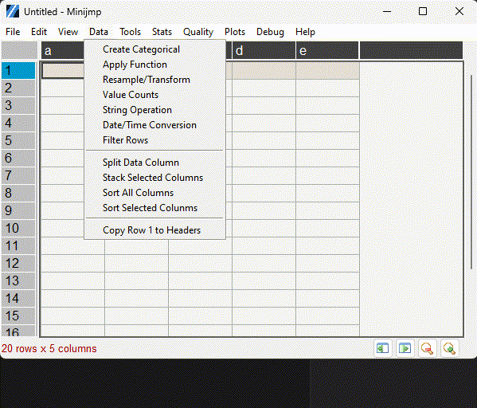
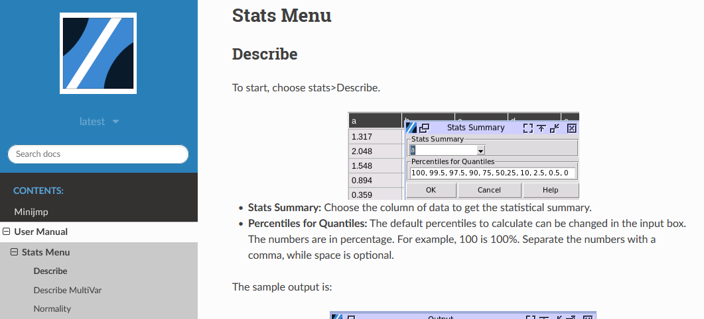

# Minijmp


Minijmp is a free, open-source program that works like Minitab Express, but comes with extra tools you'd usually find in JMP or Minitab. As of early 2024, I couldn't find any free programs that could do what JMP and Minitab do, so I decided to build one myself while working on statistics with Python.


## Current Features
The software is built on [PandasTable](https://github.com/dmnfarrell/pandastable) (by D. Farrell), utilizing its spreadsheet UI and DataFrame backend. Minijmp replicates approximately 70% of Minitab Express's statistical functions (version 0.1) and adds features like orthogonal regression, GRR, and Cpk calculations. It also includes JMP features I appreciate, such as mean comparison under JMP ANOVA and Hoeffding's D correlation.

All mathematical calculations have been calibrated against both Minitab and JMP. Since these software packages sometimes produce different results (e.g., in variance tests), Minijmp either:
- Provides options to choose between different algorithms, or
- Follows one software's approach and notes which one it follows

A quick overview of available functions (as of version 0.1) is shown below. More functions will be added after documentation and help files are completed.



## Documentation

For installation instructions, see below. For usage guidelines, please refer to [the manual](https://minijmp.readthedocs.io/en/latest/) (currently under construction).

Much more information available at [https://minijmp.readthedocs.io](https://minijmp.readthedocs.io)



## Installation

Currently, the only available method is to download the source code and run it using Python 3.8 or higher. This approach works across all major platforms (**Linux, Windows, and MacOS**). Compiled releases will be available in the future.

It is highly recommended to run Minijmp in a **virtual environment**. The software requires specific Numpy versions compatible with Scipy. (Note: Virtual environment activation instructions are not included here.)

Install the required Python libraries:

```
cd Minijmp
pip3 install -r requirements.txt
```

Run the software:

```
cd Minijmp
python start.py
```

### Troubleshooting

Ensure your Python version is 3.8 or higher. There are known issues with Python 3.12 when loading Tk.

```
python --version
```

On some systems, you may need to use `python3` to start the program if `python` points to an older version.

### Dependencies

The code requires Python 3.8.10 or higher (however known issues with 3.12 loading tk). PandasTable is already included in the source code. Due to significant modifications to the original PandasTable class, it's maintained within the package to avoid code complexity. For all other dependencies, please refer to the requirements.txt file.

