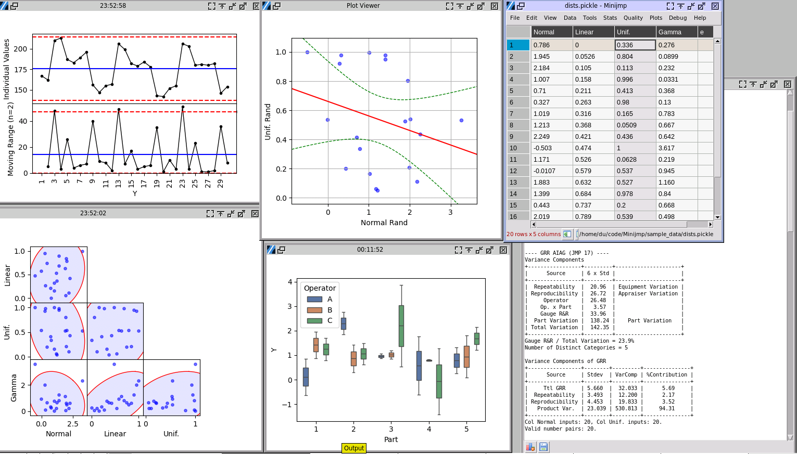

# Minijmp


Minijmp is an open source alternative of Minitab Express, also with some functions that only available in JMP or Minitab. As of early 2024, I can't find a free statistical alternative of JMP and Minitab. While writing python code to do some stats work, I decided to combine them into a Minitab like open source software. It's also a good learning process, to figure out the math behind. 

## Current Features
The software was developed based on [PandasTable (by D. Farrell)](https://github.com/dmnfarrell/pandastable), used its spreadsheet UI and DataFrame back end. I tried to replicated 70% of Minitab Express statistical functions, added those only available in full versions like orthogonal fit, GRR, Cpk and functions I like in JMP such as comparison of means under JMP ANOVA. The math has been calibrated with Minitab and JMP. The two software do not always agree with each other, for example variances test. I either give options of different algorithm to choose with, or at least make the result same to one of the software and note which it is.


Here is a quick glance of the available functions (as of ver. 0.1). After finishing the document and helps, hopefully more functions will be added.

## Documentation

For installation options see below, for usage instructions see [the manual](https://minijmp.readthedocs.io/en/latest/).

## Installation

The only available approach is to download the code and run it by python, which works for **Linux, Windows and MacOS**. Compiled releases will be done in the future. 

**It's highly recommended to run it under a virtual environment.** It requires certain Numpy versions which working with Scipy. The activation of virtual environment won't be included here. 

Install the required python libraries. 

```
cd Minijmp
pip3 install -r requirements.txt
```

Run the software.

```
cd Minijmp
python3 start.py
```


