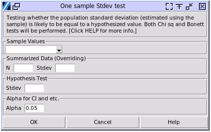

One Sample Standard Deviation Test
==================================

Choose Stats> One Sample StDev

- **Sample Values:** The column contains the sampled values. The values have to be numerical of continuous values. 
- **Summarized Data:** When knowing the statistical descriptions of the sampled values, filling out N, which is the count of the sampled values, StDev, the standard deviation of the sampled values. The filled information will override the sampled values selected above. 
- **Hypothesis Test:** The hypothesized standard deviation value of the population.
- **Alpha:** The significance level used in the calculation. For example the confidence intervals, the range of confidence intervals is (1-alpha)100%.

Many statistical methods have been developed to evaluate the variance of a population, each with its own strengths and limitations. The classical chi-square method used to test the variance is likely the most commonly used, but it is extremely sensitive to the assumption of normality and can produce extremely inaccurate results when the data are skewed or heavy-tailed. Give the data a test of its normality, before using chi_square test of variance or standard deviation. The software also provides the Bonett method to test the hypothesis, however it has to have a data set input, and won't work with summarized values inputs.

The test is not to test the standard deviation of the data set itself being equal to another hypothesized value. Similar to the mean tests, the test is to find the significance level of the population standard deviation being equal to the hypothesized value. 

The calculation was calibrated with Minitab 20.

A sample output:

.. code-block:: none

  ---- 1 sample standard deviation test ----
  N = 20  StDev: s = 0.957
  s0 = 1.000
  +-------------------+----------------+----------------+
  |                   |     Chi Sq     |     Bonett     |
  +-------------------+----------------+----------------+
  |     P-value *     |     0.874      |     0.822      |
  |   StDev CI 95.0%  | (0.728, 1.398) | (0.699, 1.453) |
  | 95.0% upper bound |     1.311      |     1.351      |
  | 95.0% lower bound |     0.760      |     0.739      |
  +-------------------+----------------+----------------+
  * H0 s==s0, H1 s!=s0
  The Bonett method is valid for any continuous distribution.
  The chi-square method is valid only for the normal distribution.

The null hypothesis of the test is that the population standard deviation is equal to the specified value, from which the dataset was sampled. The chi-square method requires normal distribution. The Bonett method requires continuous distribution, but not limited to normal distribution. While the dataset does not show significance level in the normality test, use the p-value of Bonett test.

The confidence intervals are the range of standard deviation of the population at centain possibility occurs. The range was set by alpha, which the percentage is (1-alpha)100%. The upper boundary for example is centain percentage of possibility the population standard deviation will fall less than the value, which is similar to the lower boundary.

