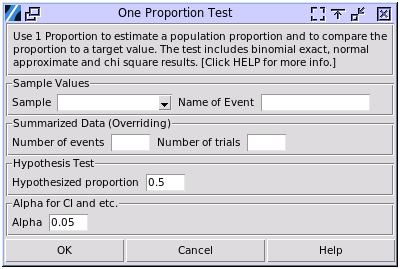

.. raw:: html

   

One Proportion Test
===================

Choose Stats > One Proportion Test

- **Sample Values:** This column contains the sampled values, which must be categorical. The **Name of Event** should match the value of the state being studied. The values do not need to be binary, but the event name should be consistent with the inputted value. All other values will be grouped into one state, effectively making the dataset binary.
- **Summarized Data:** This input will override the **Sample Values** selected above. The **Number of Events** represents the occurrence of the state, while the **Number of Trials** is the total number of data points. For example, if 250 products were made and 9 out of the 250 were defective, the **Number of Trials** should be 250, and the **Number of Events** should be 9.
- **Hypothesized Proportion:** The hypothesized proportion of the population to be tested, expressed as a number between 0 and 1.
- **Alpha:** Sets the range of confidence intervals to be calculated as (1-alpha)100%. For instance, if alpha is set to 0.05, a 95% confidence interval will be displayed.

The results consist of two parts. The first part replicates Minitab 22, unlike most software that uses version 20. The second part employs the chi-square method available in JMP 17, as a similar binomial proportion test was not found in JMP.

The results have been calibrated to Minitab 22 and JMP 17 for the two parts separately.

.. code-block:: none

  ---- One Sample Proportion Test ----

  p-value for H0: p == p0, H1: p != p0
  Normal Approx.   0.025
  Sterne's Method  0.020
  Blaker's Method  0.020
  Adj. Blaker's Exact   0.021

  H0: p == p0, H1: p < p0.
  Normal Approx. p-value = 0.012
  Clopper-Pearson Exact p-value = 0.011

  H0: p == p0, H1: p > p0.
  Normal Approx. p-value = 0.988
  Clopper-Pearson Exact p-value = 0.995

  +-----+-------+----------------+
  |  N  | Event | Sample P Ratio |
  +-----+-------+----------------+
  | 250 |   9   |     0.036      |
  +-----+-------+----------------+
  P ratio CI of 95.00%
  +-----------------+----------------+-------------+-------------+
  |       Algo      |       CI       | Upper Bound | Lower Bound |
  +-----------------+----------------+-------------+-------------+
  |  Normal Approx. | (0.013, 0.059) |    0.055    |    0.017    |
  | Clopper-Pearson | (0.017, 0.067) |    0.062    |    0.019    |
  |   Blaker Adj.   | (0.018, 0.066) |      -      |      -      |
  +-----------------+----------------+-------------+-------------+
  Note: The results have been calibrated with Minitab 22, which 
  uses the adjusted Blaker's exact method for H1 p != p0, and 
  Clopper-Pearson exact for H1 p > p0 and p < p0.

The first part, aligned with Minitab 22, focuses on the binomial distribution and its approximation. It is noteworthy that methods for calculating confidence intervals of the binomial distribution are still evolving in the 2020s. The methods for calculating p-values and confidence intervals with the alternative hypothesis that the population proportion is not equal to the hypothesized proportion differ between Minitab 22 and Minitab 20. Here, we align with version 22. Normal approximation is not available in version 22, which aligns with the previous version.

The sample output above discusses a scenario from a book by Kenji Kurogane. The question posed is whether a process change has reduced the defect rate from 7.3% after observing 9 defective products out of 250. The book, which is quite old, demonstrated using normal approximation to calculate the significance level. When a binomial sample set has either p <= 0.5 and np >= 5, or p >= 0.5 and (1-p)n >= 5, the distribution can be approximated to a normal distribution. The normal approximation is easier for manual calculation.

Another category of methods is binomial exact methods, which use the discrete binomial distribution to calculate results. All methods except for normal approximation are exact methods, such as Sterne's method, Blaker's method, Adjusted Blaker's exact, and Clopper-Pearson Exact.

Sterne's and Blaker's methods have been found to have coverage probabilities significantly closer to the nominal level (e.g., 0.95 for a 95% confidence interval) compared to other exact methods. Clopper-Pearson is known to be very conservative, often producing wider intervals than necessary. The adjusted Blaker exact method produces two-sided confidence intervals for the proportion of events and p-values for the alternative hypothesis of p ≠ p0. Blaker provides an exact, two-sided confidence interval by inverting the p-value function of an exact test. The Clopper-Pearson intervals are wider and always contain the Blaker confidence intervals. Intervals from the Blaker exact method are nested, meaning that confidence intervals with higher confidence levels contain those with lower confidence levels. For example, an exact, two-sided Blaker 95% confidence interval contains the corresponding 90% confidence interval.

Blaker's original exact method has a limitation: for some data, it produces an interval that covers a hypothesized proportion when the p-value is less than the significance level corresponding to the confidence level. The limitation also arises when the confidence interval does not contain a hypothesized proportion when the p-value is greater than the significance level corresponding to the confidence level.

The adjusted Blaker exact method overcomes these limitations. This numerical algorithm produces confidence intervals and tests that generally agree. The adjusted Blaker confidence intervals are also exact and nested.

It is recommended to use the adjusted Blaker exact method's p-value and confidence intervals when the alternative hypothesis is p != p0. For the alternative hypothesis (H1) being either p > p0 or p < p0, use the Clopper-Pearson Exact p-value and its upper/lower bounds.

.. code-block:: none

  ---- Chi-Square Test ----
  df = 1
  +------------------+--------+-----------+
  |       Test       | Chi sq | P > ChiSq |
  +------------------+--------+-----------+
  | Likelihood Ratio | 6.139  |   0.013   |
  |     Pearson      | 5.057  |   0.025   |
  +------------------+--------+-----------+

In JMP 17, after plotting the distribution of a categorical sample, `test proportion` can be selected in the red triangle. JMP uses the chi-square method, which is an approximation method. This method works better with large sample sizes and is compatible with more than two types of states in the sample. Minitab's binomial exact methods are more accurate for small samples but are limited to binary states.

The p-value here is the `P > ChiSq` value. The null hypothesis is p == p0, while the alternative hypothesis is p != p0.

Reference links: `Minitab Help Pages <https://support.minitab.com/en-us/minitab/help-and-how-to/statistics/basic-statistics/how-to/1-proportion/methods-and-formulas/methods-and-formulas/>`_ `BlakerCI module in R <https://cran.r-project.org/web/packages/BlakerCI/BlakerCI.pdf>`_
