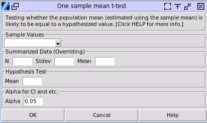

One Sample Mean t-test
======================

Choose Stats> One Sample Mean t-test

- **Sample Values:** This column contains the sampled values, which must be numerical and continuous.
- **Summarized Data:** If you know the statistical descriptions of the sampled values, fill in `N` (the count of the sampled values), `Std Dev` (the standard deviation of the sampled values), and the mean. This information will override the sampled values selected above.
- **Hypothesis Test:** The hypothesized mean value of the population.
- **Alpha:** The significance level used in the calculation. For example, for confidence intervals, the range is (1-alpha)100%.

A one-sample t-test is a statistical procedure used to determine whether the mean of a single sample differs significantly from a known or hypothesized population mean.

In a one-sample t-test, we're comparing a sample mean to a hypothesized population mean (often called μ₀ or a test value). While the sample mean (x̄) is indeed a specific calculated number from our data, the key idea is that we're testing whether this sample mean could reasonably have come from a population with our hypothesized mean. For example, if we calculate a sample mean of 72.5 from our data and we're testing against a hypothesized population mean of 70, we're not asking if 72.5 exactly equals 70 (which it clearly doesn't). Instead, we're asking whether the difference between 72.5 and 70 is large enough to conclude that our sample likely came from a population with a different mean, or if this difference could reasonably occur by chance when sampling from a population with mean 70. This is why we use concepts like sampling distribution and probability to make this determination, rather than strict numerical equality.

.. code-block:: none

  ---- One sample t ----
  mean = 1.141
  SD = 1.222
  t = -0.580
  df = 19.000
  u0 = 1.300
  Two-tailed test H0 u==u0, H1 u!=u0: p = 0.569
  P-value is the prob of that population mean equals the specified 
  value, which the samples came from.
  95.00% range of population mean which the samples came 
  from: (0.570, 1.713)
  H0 u==u0, H1 u>u0 p value = 0.716
  95.00% Lower bound of population mean: 0.669
  H0 u==u0, H1 u<u0 p value = 0.284
  95.00% Upper bound of population mean: 1.614

The t-test is based on the t-distribution, which is a probability distribution that underlies the statistical analysis in a t-test. Here's a description of the key concepts behind the t-test:

- The t-distribution, also known as Student's t-distribution, is a family of continuous probability distributions that arises when estimating the mean of a normally distributed population in situations where the sample size is small and the population standard deviation is unknown.
- Degrees of Freedom: The shape of the t-distribution is determined by its degrees of freedom. In this t-test, the degrees of freedom is one less than the sample size.
- Hypotheses: Null hypothesis (H0): The population mean (estimated by the sample mean) is equal to the specified value. Alternative hypothesis (H1): The population mean is different from the specified value.
- When P-value is smaller than the significance level, the null hypothesis should be rejected. Or in another way, the p-value is the probability the population mean equals to the hypothesized population mean.
- The confidence intervals of the population mean, the percentage size of the range is set by alpha.
- In a t-test, the null hypothesis (H0) and alternative hypothesis (H1) can indeed be formulated as you described, with H0: μ = μ0 and H1: μ > μ0. This is known as a one-tailed or directional test. If H0 is rejected, we accept that the true mean is greater than μ0, which is precisely what H1 states.
