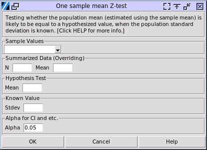

.. raw:: html

   

One Sample Mean Z-test
======================

Choose Stats > One Sample Mean Z-test

- **Sample Values:** This column contains the sampled values, which must be numerical and continuous.
- **Summarized Data:** If you know the statistical descriptions of the sampled values, fill in N (the count of the sampled values) and the mean. This information will override the sampled values selected above.
- **Hypothesis Test:** The hypothesized mean value of the population must be inputted.
- **Known Values:** The known population standard deviation must be inputted.
- **Alpha:** The significance level used in the calculation. For example, for confidence intervals, the range is (1-alpha)100%.

.. list-table:: Comparison of Z-test and t-test
   :header-rows: 1
   :class: tight-table

   * - Aspect
     - Z-test
     - T-test
   * - Population standard deviation
     - Known
     - Unknown, estimated from sample
   * - Sample size
     - Typically larger (>30)
     - Often smaller (<30)
   * - Distribution
     - Standard normal (z-distribution)
     - t-distribution (varies with degrees of freedom)
   * - Formula
     - :math:`z = \frac{\bar{x} - \mu}{\sigma / \sqrt{n}}`
     - :math:`t = \frac{\bar{x} - \mu}{s / \sqrt{n}}`
   * - Robustness
     - Assumes normal distribution
     - More robust to slight deviations from normality
   * - Degrees of freedom
     - Not used
     - Used, affects t-distribution shape
   * - Practical use
     - Less common (population σ rarely known)
     - More common in real-world applications

A sample output:

.. code-block:: none

  ---- One Sample Z ----
  mean = 1.178
  z = -2.880
  df = 19.000
  u0 = 1.500
  Known StDev = 0.500
  Two-tailed test H0: μ = μ0, H1: μ ≠ μ0: p = 0.004
  The p-value is the probability that the population mean equals the specified value from which the samples came.
  95.00% range of population mean from which the samples came: (0.959, 1.397)
  H0: μ = μ0, H1: μ > μ0 p-value = 0.998
  95.00% Lower bound of population mean: 0.994
  H0: μ = μ0, H1: μ < μ0 p-value = 0.002
  95.00% Upper bound of population mean: 1.362

- Hypotheses: Null hypothesis (H0): The population mean (estimated by the sample mean) is equal to the specified value. Alternative hypothesis (H1): The population mean is different from the specified value.
- When the p-value is smaller than the significance level, the null hypothesis should be rejected. Alternatively, the p-value is the probability that the population mean equals the hypothesized population mean.
- The confidence intervals of the population mean are determined by the percentage size of the range set by alpha.
- In a t-test, the null hypothesis (H0) and alternative hypothesis (H1) can indeed be formulated as described, with H0: μ = μ0 and H1: μ > μ0. This is known as a one-tailed or directional test. If H0 is rejected, we accept that the true mean is greater than μ0, which is precisely what H1 states.
