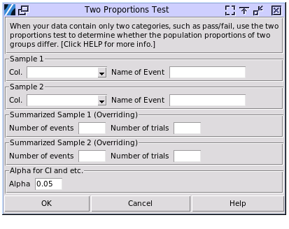

.. raw:: html

   

Two Proportions Test
====================

Choose Stats > Two Proportions Test

- **Sample Values:** This column contains the sampled values, which must be categorical. The **Name of Event** should be the value of the state to be studied. The values do not have to be binary, but the event name should be consistent with the inputted value. All other values will be considered as one state, effectively making the dataset binary.
- **Summarized Data:** This input will override the **Sample Values** selected above. The **Number of Events** is the occurrence of the state, and the **Number of Trials** is the total number of data points. For example, if 250 products were made and 9 out of the 250 were defective, the **Number of Trials** should be 250, and the **Number of Events** should be 9. The input of samples can be mixed; for example, Sample 1 can be inputted by a column of data, while Sample 2 can be inputted by summarized data.
- **Alpha:** Set the range of confidence intervals to be calculated as (1-alpha)100%. For example, when alpha is set to 0.05, a 95% confidence interval will be displayed.

The test uses normal approximation and Fisher's exact method to calculate p-values, normal approximation for confidence intervals, and pooled normal approximation. It tests three sets of null hypotheses: that the two population proportions are equal, that one proportion is greater than the other, and that the two proportions differ. All results are printed together without needing to select options.

The results align with Minitab 20.

A sample output:

.. code-block:: none

   ---- Two samples proportion test ----
   +--------+------+--------+---------+
   | Sample |  N   | Events | P ratio |
   +--------+------+--------+---------+
   |   1    | 250  |   9    |  0.036  |
   |   2    | 1000 |   73   |  0.073  |
   +--------+------+--------+---------+

   P1 - P2 = -0.037
   95.00% CI of difference (-0.065, -0.009)
   95.00% Upper bound for difference -0.013
   95.00% Lower bound for difference -0.061

   H0: P1 == P2
   +---------------------+--------+----------+---------+---------+
   |       p-value       |   Z    | P1 != P2 | P1 < P2 | P1 > P2 |
   +---------------------+--------+----------+---------+---------+
   |    Fisher's Exact   |        |  0.032   |  0.020  |  0.992  |
   |     Normal appx.    | -2.575 |  0.010   |  0.005  |  0.995  |
   | Normal appx. Pooled | -2.113 |  0.035   |  0.017  |  0.983  |
   +---------------------+--------+----------+---------+---------+

The confidence intervals and the lower/upper bounds are for the difference of P1 - P2. The observed value here is -0.037. The difference between the two population proportions has a 95% probability of falling inside the range of the confidence intervals, being smaller than the upper bound, and being greater than the lower bound. The 95% range is set by the alpha value.

Fisher's Exact method uses the binomial distribution with discrete event numbers to calculate the probability. The columns represent different alternative hypotheses of the null hypothesis. If unsure, refer to the alternative hypothesis that P1 is not equal to P2.

Normal Approximation works when both samples meet the condition of either np >= 5 or (1-p)n >= 5. This method is suitable for large datasets, not for those with small sample sizes.

.. list-table:: Comparison of Fisher's Exact Test and Normal Approximation
   :header-rows: 1
   :widths: 20 40 40
   :class: tight-table

   * - Aspect
     - Fisher's Exact Test
     - Normal Approximation (Z-test for Two Proportions)
   * - Assumptions
     - Does not rely on large sample assumptions. Suitable for small sample sizes. Assumes fixed margins in a contingency table.
     - Assumes a large enough sample size and meets the condition of either np >= 5 or (1-p)n >= 5.
   * - Applications
     - Used for small sample sizes and 2x2 contingency tables.
     - Used for large sample sizes and comparing proportions in large datasets.

The pooled estimate of the proportion in a two-proportion z-test is used when the null hypothesis assumes that the two population proportions are equal. This approach is appropriate when both sample sizes are sufficiently large, allowing for the normal approximation to be valid. The pooled proportion provides a single estimate of the common proportion by combining the successes and total observations from both samples.

.. list-table:: Pooled vs Unpooled Normal Approximation in Two-Proportion Test
   :header-rows: 1
   :widths: 20 40 40
   :class: tight-table

   * - Aspect
     - Pooled
     - Unpooled
   * - Usage
     - When H0: P1 = P2
     - For confidence intervals or suspected different proportions
   * - Proportion Estimate
     - :math:`\hat{p} = \frac{x_1 + x_2}{n_1 + n_2}`
     - Separate estimates for each sample
   * - Standard Error
     - :math:`SE = \sqrt{\hat{p}(1-\hat{p})(\frac{1}{n_1} + \frac{1}{n_2})}`
     - :math:`SE = \sqrt{\frac{\hat{p_1}(1-\hat{p_1})}{n_1} + \frac{\hat{p_2}(1-\hat{p_2})}{n_2}}`
   * - Z-statistic
     - :math:`Z = \frac{\hat{p_1} - \hat{p_2}}{\sqrt{\hat{p}(1-\hat{p})(\frac{1}{n_1} + \frac{1}{n_2})}}`
     - :math:`Z = \frac{\hat{p_1} - \hat{p_2}}{\sqrt{\frac{\hat{p_1}(1-\hat{p_1})}{n_1} + \frac{\hat{p_2}(1-\hat{p_2})}{n_2}}}`
   * - Preferred When
     - Equal sample sizes, testing H0: P1 = P2
     - Unequal sample sizes, suspected different proportions
