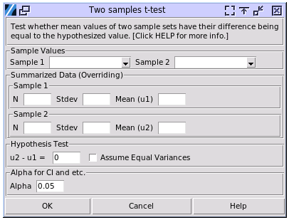

Two Samples t-test
==================

Choose Stats> Two Samples t-test

- **Sample Values:** The columns that contain the sampled values. The values have to be numerical and continuous. 
- **Summarized Data:** The input will override the the columns selected above. The sample 1 and sample 2 can use different input approaches. For example sample 2 was inputed by selecting a column of data, while sample 1 was inputted by the summarized data.
- **Hypothesis Test:**

  - **u2 - u1** the hypothesized difference between the two samples. The value can be negative, when the mean of sample 2 is expected less than the mean of sample 1. 
  - **Assume Equal Variance:** Assuming equal variance means that the population variances of the two groups being compared are considered to be the same (:math:`\sigma_1^2 = \sigma_2^2`). This is also called the pooled variance assumption. If the variances are not actually equal, this test can lead to incorrect results, either rejecting when it shouldn't or failing to reject when it should. 

- **Alpha:** The significance level used in the calculation. For example the confidence intervals, the range of confidence intervals is (1-alpha)100%.

The results of unequal variances were aligned with JMP 17. The pooled variance results were aligned with Minitab 20 and JMP 17.

A sample output:

.. code-block:: none

  ---- Two Samples t tests ----
  u1 = 1.000      s1 = 1.000      n1 = 20
  u2 = 0.718      s2 = 0.914      n2 = 20
  d0 = 0.000      u2 - u1 = -0.282
  
  JMP 17 method unequal variances
  95.00% CI of u2 - u1: (-0.895,0.332)
  df = 37.698     t = -0.931
  H0: u2 - u1 == d0, H1: u2 - u1 != d0, p = 0.358
  H0: u2 - u1 == d0, H1: u2 - u1 < d0, p = 0.179
  H0: u2 - u1 == d0, H1: u2 - u1 > d0, p = 0.821

The first two rows of the output are the statistics of the two samples. `d0` is the hypothesized difference of `u2 - u1`. Three sets of null hypothesis and alternative hypothesis were tested. If not sure, use the first null hypothesis with alternative hypothesis that the u2 - u1 difference is not equal to the hypothesized value. In the example above, the p-value is greater than 0.05 (for example), the null hypothesis can't be rejected. 

