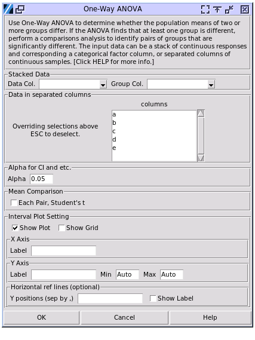
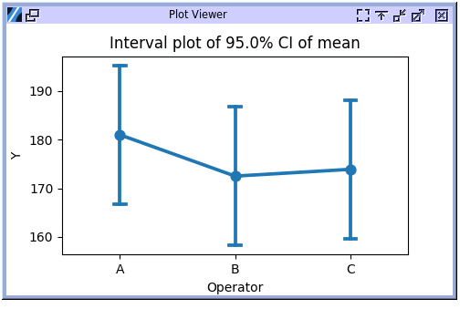

One-Way ANOVA
=============

Choose Stats > One-Way ANOVA

- **Stacked Data:** Select a column conatining categorical factors for `Group Column` and a column that contains continuous responses for `Data Column`. Both need be selected.
- **Data in separated columns:** Select multiple columns with your mouse, using SHIFT-Click to select a range, and CTRL-Click to toggle a single selection. The selected columns must contain continuous data. Categorical data will be ignored. The columns do not need to have the same number of observations.
- **Alpha:** Set the range for confidence intervals to be calculated as (1-alpha)100%. When alpha is set to 0.05, a 95% confidence interval will be displayed. The alpha value is also used in the mean comparison method to determine if two population means are different.
- **Mean Comparison:** Select this option to identify groups that are significantly different in mean.
- **Interval Plot Setting:** A plot of means and their confidence intervals will be drawn by default.

  - **Label:** If left blank, the axis will be labelled with the data column name.
  - **Min and Max:** The default min and max of axis are set by the **Margin** in **Plot Setting** below. 
  - **Grid:** The grid won't be shown by default.
  - **Horizontal Ref Lines:** Add reference horizontal dashed lines at specified positions. Multiple lines can be drawn by separating inputs with a comma. For example both `20` and `20, 30, 40` are valid inputs.
  - **Show Label:** Toggle the value label on the right for the reference lines.

The one-way ANOVA results align with both Minitab 22 and JMP 17. The mean comparison replicates the function in JMP 17. The plot uses the Minitab method to demonstrate the interval plot.

.. code-block:: none

  ---- Oneway Anova ----
  Analysis of Variance
  +---------+----+-----------+---------+---------+---------+
  |  Source | DF |  Adj. SS  | Adj. MS | F Ratio | P Value |
  +---------+----+-----------+---------+---------+---------+
  | Between | 2  |  415.400  | 207.700 |  0.429  |  0.656  |
  |  Within | 27 | 13077.400 | 484.348 |         |         |
  |  Total  | 29 | 13492.800 |         |         |         |
  +---------+----+-----------+---------+---------+---------+
  
  Means of Oneway Anova
  +-------+----+---------+---------+--------------------+
  | Level | N  |   Mean  | SE Mean | 95.00% CI of Mean  |
  +-------+----+---------+---------+--------------------+
  |   A   | 10 | 181.000 |  6.960  | (166.720, 195.280) |
  |   B   | 10 | 172.500 |  6.960  | (158.220, 186.780) |
  |   C   | 10 | 173.900 |  6.960  | (159.620, 188.180) |
  +-------+----+---------+---------+--------------------+
  Note: SE Mean and CI both use a pooled estimate of error variance = 484.348.
  
The example is an analysis of the sample data from `gasket.pickle`, selecting the `Y` column as the data column of response, and the `Operator` column as the group column. The null hypothesis is that the response means are equal across all different groups or levels of the effect. Here, a level of the effect means a value of the categorical variable; for example, there are 3 operators, which means there are 3 levels in the effect variable of `Operator`. The p-value in the analysis of variance table is greater than common significance levels, so we can't reject the null hypothesis.

The `Source` of variance includes `Between` and `Within`. `Between` refers to the variance between the groups. In the example, it's the variance brought by the difference of operators. `Within` refers to the variance within each group. Thus, in the example, it is the variance of measurement for each operator.

The **total degrees of freedom (DF)** represent the amount of information in your data. The analysis uses that information to estimate the values of unknown population parameters. The total DF is determined by the number of observations in your sample. **Adjusted sums of squares (Adj. SS)** are measures of variation for different components of the model. **Adjusted mean squares (Adj. MS)** measure how much variation a term or a model explains. Unlike the adjusted sums of squares, the adjusted mean squares consider the degrees of freedom, which is Adj. SS divided by DF.

The adjusted mean squares demonstrate the relationship between different sources of variance. In the example above, the variance within each operator's measurement is larger than the variance brought by different operators. **F Ratio** is the ratio of these two values, which is used for p-value calculation.

In the **Means of One-Way ANOVA** table, the confidence intervals (CI) are ranges of values that are likely to contain the true mean of each population. The confidence intervals are calculated using the pooled standard deviation. The pooled standard deviation is an estimate of the common standard deviation for all levels. The pooled standard deviation is the standard deviation of all data points around their group mean (not around the overall mean). Larger groups have a proportionally greater influence on the overall estimate of the pooled standard deviation. So the confidence intervals there are not the same as the confidence intervals that were calculated by individual samples.

Use the confidence interval to assess the estimate of the population mean for each group. For example, with a 95% confidence level, you can be 95% confident that the confidence interval contains the group mean.

Mean Comparison
---------------

The null hypothesis of the One-Way ANOVA test is that the population means of all groups are equal. When the p-value is less than the significance level, the alternative hypothesis is that at least one of the population means is not equal to the others. At this point, it's a good idea to perform a comparison analysis to identify pairs of groups that are significantly different.

Continue using the data file `gasket.pickle` from the previous example, but change the group column to `Parts`. The p-value is less than typical significance levels.

.. code-block:: none

  ---- Oneway Anova ----
  Analysis of Variance
  +---------+----+-----------+----------+---------+---------+
  |  Source | DF |  Adj. SS  | Adj. MS  | F Ratio | P Value |
  +---------+----+-----------+----------+---------+---------+
  | Between | 4  | 12791.133 | 3197.783 | 113.935 |  0.000  |
  |  Within | 25 |  701.667  |  28.067  |         |         |
  |  Total  | 29 | 13492.800 |          |         |         |
  +---------+----+-----------+----------+---------+---------+

In this case, the adjusted mean squares within the group are much lower than those between the groups, and the p-value is lower than the significance level. The null hypothesis that means are equal in all groups should be rejected. Use the `Mean Comparison` tool and select `Each pair student's t` to find out which groups may have different mean values. Select data as in the one-way ANOVA, and check `Each pair student's t` to run the calculation.

.. code-block:: none

  ---- Means Comparisons ----
  t test p value matrix, H0: u1 == u2, H1: u1 != u2
  +---+------+------+------+------+
  |   |  1   |  2   |  3   |  4   |
  +---+------+------+------+------+
  | 2 | 0.00 |      |      |      |
  | 3 | 0.00 | 0.00 |      |      |
  | 4 | 0.00 | 0.00 | 0.36 |      |
  | 5 | 0.00 | 0.00 | 0.00 | 0.00 |
  +---+------+------+------+------+
  
  Connecting Report
  +----------+-------+---------+
  | Grouping | Level |   Mean  |
  +----------+-------+---------+
  | A        |   2   | 206.167 |
  |   B      |   4   | 184.833 |
  |   B      |   3   | 182.000 |
  |     C    |   1   | 158.000 |
  |       D  |   5   | 148.000 |
  +----------+-------+---------+

The method is to perform t-test mean to each pair of the groups. The first table shows the p-value of the t-test result. For this case only part 3 and part 4 have their t-test p-value greater than the significance level, which was set by the Alpha value.

The second table groups the samples having t-test p-value greater than the significance level. One sample can be included into multiple groups, while each sample in one same group will have t-test p-value greater than the significance level. In another word, for each group, all the samples have a same mean value. 

