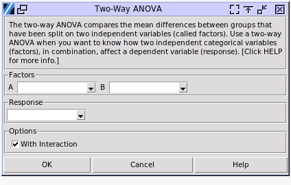

Two-Way ANOVA
=============

Choose Stats> Two-Way ANOVA

- **Factors:** The independent categorical variables in columns. The only way to have the data is stacked. The data can be text or numerical.
- **Response:** The dependent numerical variable in its column. It has to be a quantitative variable that represents amounts or counts of things, which can be divided to find a group mean. 

The Two-Way ANOVA results were aligned with both JMP 17 and Minitab 22. Please note that the Two-Way ANOVA doesn't have a standalone menu entry in those two softwares, but can be realized by general linear models with least square methods.

.. code-block:: none

  ---- Two Way ANOVA With
  +----------+--------+
  |  Factor  | Levels |
  +----------+--------+
  | Operator |   3    |
  |   Part   |   5    |
  +----------+--------+
  
  Analysis of Variance
  +---------------+----+-----------+----------+---------+---------+
  |     Source    | DF |   Adj SS  |  Adj MS  | F-value | p-value |
  +---------------+----+-----------+----------+---------+---------+
  |    Operator   | 2  |  415.400  | 207.700  |  17.025 |  0.000  |
  |      Part     | 4  | 12791.133 | 3197.783 | 262.113 |  0.000  |
  | Operator*Part | 8  |  103.267  |  12.908  |  1.058  |  0.439  |
  |     Error     | 15 |  183.000  |  12.200  |         |         |
  |     Total     | 29 | 13492.800 |          |         |         |
  +---------------+----+-----------+----------+---------+---------+

The example is an analysis of the sample data of `gasket.pickle`, selecting `Y` column as the data column of response, `Part` and `Operator` columns as the factors. A two-way ANOVA with interaction tests three null hypotheses at the same time:

- There is no difference in group means at any level of the first independent variable.
- There is no difference in group means at any level of the second independent variable.
- The effect of one independent variable does not depend on the effect of the other independent variable (a.k.a. No interaction effect).
 
It is straight forward for the first two null hypotheses which are similar to the one-Way ANOVA. The third null hypotheses tests the interaction between the two factors. For example, in the data set above of operators measuring different parts, there is one or two operators handle large parts badly and generate large offsets in the results. 

In the sample above, the two independent factors both have significent impact to the group mean, while the interaction of the two factors does not. However, if we compare the one-Way ANOVA result here `LINK <https://minijmp.readthedocs.io/en/latest/usage/anova_1way.html>`_, the one-Way ANOVA result didn't reject the null hypotheses of `operator` has impact to mean values, with a p-value 0.6. While in the Two-Way ANOVA example, its p-value is much smaller. 

This should be explained by the algorithm of ANOVA. The p-value is determined by an F distribution with the F-value and the degrees of freedom of the factor and error. In one-Way ANOVA the error is the row of `Within`. The F-value is ratio between adjusted mean square of the factor and error. The total square sum of the system is identical in one-Way ANOVA and Two-Way ANOVA, while the square sum of the `Operator` factor is same too. In one-Way ANOVA, all the rest of square sum of the variation except for the `Operator` was counted into error. In Two-Way ANOVA, after the factor of `Part` and interaction were considered, the square sum of the error became much smaller. 

In a simple way, the variation between part to part was counted into the operators' measurement error, which makes the variation of one operator's results larger than the variation between the operators. So it's important of design of the experiement to include more controllable factors than counting their impacts into errors.

