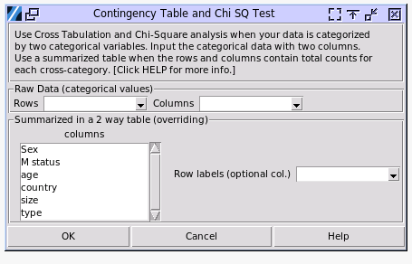

Cross Tabulation and Chi-Square
===============================

Choose Stats > Contingency table & Chi2

- **Raw Data**: Select two columns of categorical data, such as hair color and skin color, where each row represents a data point (e.g., a person). The data points should be of string type, and numerical values will be treated as categorical. Swapping the row and column will not change the Chi-Square result.
- **Summarized 2 Way Table**: Data can also be input as a summarized table, with columns representing each category of one variable and rows representing each category of another variable. The cells contain the counts of each cross-category. The cell values must be integers, but float inputs will not be rounded in the calculation.

  - **Row Labels**: The name of each category of the row variable. By default, categories will be set in capital letters without an input. The names of column variable categories will be set by the column names.

The Chi Square results are consistent with both JMP 17 and Minitab 22.

Open the sample data file `car_poll.pickle` in the `sample_data` folder. Select the columns and rows as `Sex` and `type`. The result is shown below.

.. code-block:: none

   ---- Contingency Table ----
   +----------------+------------+------------+------------+-------+
   | Count/Expected |   Family   |   Sporty   |    Work    | Total |
   +----------------+------------+------------+------------+-------+
   |     Female     | 76 / 70.59 | 41 / 45.54 | 21 / 21.86 |  138  |
   |      Male      | 79 / 84.41 | 59 / 54.46 | 27 / 26.14 |  165  |
   |     Total      |    155     |    100     |     48     |  303  |
   +----------------+------------+------------+------------+-------+
   
   ---- Chi square test ----
   df = 2
   +------------------+--------+-----------+
   |       Test       | Chi sq | P > ChiSq |
   +------------------+--------+-----------+
   | Likelihood Ratio | 1.659  |   0.436   |
   |     Pearson      | 1.655  |   0.437   |
   +------------------+--------+-----------+

A cross tabulation displays the joint frequency of data values based on two or more categorical variables. Cross tabulation analysis is used for two-way tables and is also known as contingency table analysis. In the contingency table, the count value is the total number of data points sharing the same categorical values in two variables. The expected values are the values distributing the total counts of each row by the ratio of counts in columns.

The joint frequency data are analyzed with the chi-square statistic to evaluate whether the variables are associated or independent. For a chi-square test for association, the hypotheses are as follows:

  - H0: The variables are independent; no association between variables exists.
  - H1: The variables are not independent; an association between variables exist and variables are dependent. 

The software uses the Pearson test and the Likelihood-Ratio test to determine whether an association between machine and shift exists. Because the p-values for the Pearson test and the Likelihood-Ratio test are more than 0.05, we cannot reject the null hypothesis and conclude that there is no association between the type of cars and the gender of buyers.
