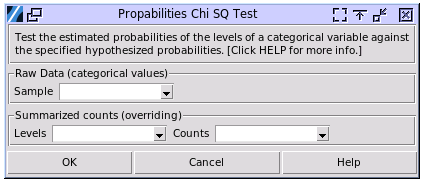
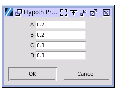

Probabilities Chi Square Test
=============================

Choose Stats > Proportion Chi Square

The first window is used to collect the sampled levels and their frequencies.

- **Raw Data**: Select the column of categorical sample the levels. The cell contents can be numerical or string, but numerical values will be treated as strings for levels. 
- **Summerized Counts**: Select two columns of data, with one column containing the level names and the other column containing the corresponding counts, frequencies or ratios. 

The second window is used to collect the hypothesized probabilities. The probability values must be greater than zero and less than one for the Chi Square test. If all the inputed hypothesized probabilities do not sum to one, the numbers will be scaled.

Open the sample data file `car_poll.pickle` in the `sample_data` folder. Select the column of `type` as the raw data, and input equal hypothesized probabilities for the three levels. Below is the output.

.. code-block:: none

   ---- Test Probabilities ----
   +--------+----------+-------------+
   | Level  | Est Prob | Hypoth Prob |
   +--------+----------+-------------+
   | Large  |  0.139   |    0.333    |
   | Medium |  0.409   |    0.333    |
   | Small  |  0.452   |    0.333    |
   +--------+----------+-------------+
   
   ---- Chi square test ----
   df = 2
   +------------------+--------+-----------+
   |       Test       | Chi sq | P > ChiSq |
   +------------------+--------+-----------+
   | Likelihood Ratio | 60.706 |   0.000   |
   |     Pearson      | 52.535 |   0.000   |
   +------------------+--------+-----------+

The null hypothesis is that the true probabilities in each level of the response are equivalent to the hypothesized probabilities. The alternative hypothesis is that at least two of the true probabilities differ from the hypothesized probabilities.

The software uses the Pearson test and the Likelihood-Ratio test to determine the Chi-Square values and p-values. Because the p-values for the Pearson test and the Likelihood-Ratio test are far less than 0.05, we can reject the null hypothesis and conclude that at least two of the true probabilities differ from the hypothesized probabilities.
