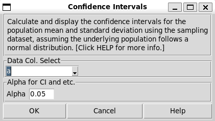

Confidence Intervals
--------------------

Choose Stats>Confidence Intervals.

- **Data Col. Select:** Select the sampled dataset, i.e. a column of data. The population who was sampled from should be normally distributed. 

- **Alpha:** The Confidence Intervals want to calculate. 0.05 stands for 95% probability range of the population mean and standard deviation, while 0.1 stands for 90%, and so on.

A sample output:

.. code-block:: none

  ---- Confidence Intervals ----
  For the population where the samples came from:
  
  95.0% Prob that mean is in the range of (0.520, 1.469)
  95.0% Prob that mean is less than 1.386.
  95.0% Prob that mean is greater than 0.602.
  
  95.0% Prob that stdev is in the range of (0.771, 1.480)
  95.0% Prob that stdev is less than 1.389.
  95.0% Prob that stdev is greater than 0.805.
  Stdev CI method is same to JMP but different from Minitab.

Interpretation:

- **Two-sided Confidence Interval:** A 95% two-sided confidence interval with bounds of (-0.119, 0.852) for a population mean can be interpreted as: "We are 95% confident that the true population mean falls between -0.119 and 0.852." This means that if we were to repeat the sampling process many times and calculate the confidence interval each time, about 95% of these intervals would contain the true population mean.

- **One-sided Confidence Interval:** A 95% one-sided upper bound of 0.767 can be interpreted as: "We are 95% confident that the true population mean is less than or equal to 0.767." Similarly, a 95% one-sided lower bound of -0.035 can be interpreted as: "We are 95% confident that the true population mean is greater than or equal to -0.035."

The Interpretation of CI of standard deviation is same to the mean CI above. 

