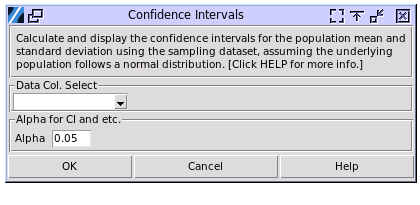

Confidence Intervals
--------------------

Choose Stats>Confidence Intervals.

- **Data Col. Select:** Select the sampled dataset, i.e. a column of data. The population who was sampled from should be normally distributed. 

- **Alpha:** The Confidence Intervals want to calculate. 0.05 stands for 95% probability range of the population mean and standard deviation, while 0.1 stands for 90%, and so on.

A sample output:

.. image:: images/ci2.png
   :align: center

Interpretation:

- **Two-sided CI:** A 95% two-sided CI of (-0.119, 0.852) for a population mean can be interpreted as: "We are 95% confident that the true population mean falls between -0.119 and 0.852." This means that if we were to repeat the sampling process many times and calculate the CI each time, about 95% of these intervals would contain the true population mean.

- **One-sided CI:** A 95% one-sided upper CI of (-, 0.767) can be interpreted as: "We are 95% confident that the true population mean is less than or equal to 0.767." A 95% one-sided lower CI of (-0.035, +) can be interpreted as: "We are 95% confident that the true population mean is greater than or equal to -0.035."

The Interpretation of CI of standard deviation is same to the mean CI above. 

