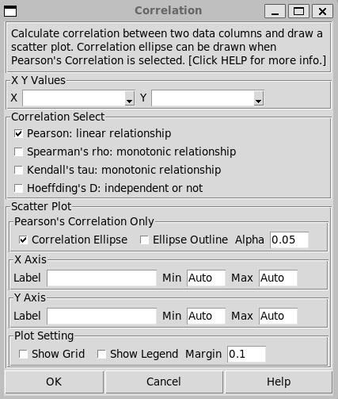
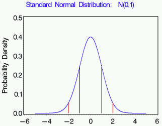
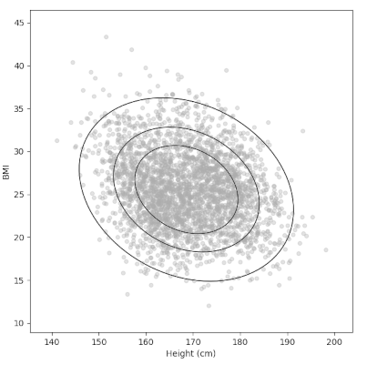

Correlation
===========

Choose Stats>Correlation.

Correlation is a statistical measure that describes the strength and direction of the relationship between two variables.

- **X Y Values:** Select the two sets of data. The order of the dataset, either which is X, won't change the correlation result, but only the plotting orientation. 
- **Correlation Select:**  There are two main types of correlation analyses: parametric (like Pearson's correlation) and nonparametric (such as Spearman's and Kendall's correlations). Their difference will be discussed, however select Pearson's Correlation by default if you are not sure.
- **Scatter Plot Setting:** A scatter plot of data will be displayed, all the settings below are about this plot. 

  - **Correlation Ellipse:** Display a light blue filled ellipse for Bivariate Normal Distribution, which is only available with Pearson's correlation.
  - **Ellipse Outline:** Display a red outline of the ellipse above. Either of these two settings can work alone, but also together.
  - **Alpha:** It determines the contour level of the ellipse. If alpha is 0.05, the ellipse of 95% Probability Contour will be displayed; while 0.3 for 70% of Probability Contour. Leave it by default if you are not sure. This alpha also determines the confidence intervals range of the Pearson's correlation coefficient. 
  - **Axis Settings:**

    - **Label:** If left blank, the axis will be labelled with the data column name.
    - **Min and Max:** The by-default min and max of axis are set by the **Margin** in **Plot Setting** below. 
    - **Legend and Grid:** They won't be shown by default.
    - **Margin:** A margin of 0.1 means using a width of 10% of range of data as the blank margin of the plot.

The results of correlation have been calibrated with Minitab 20, JMP pro 17 and R (lib Hmisc 5.1).

- The Pearson's correlation shows same result to Minitab, while I didn't find CI of correlation coefficient in JMP.
- The Spearman's rho and Kendall's tau are same to the JMP results, p-value of Kendalls in a few cases showed <0.1 difference from JMP, though not affecting judgement. 
- The Hoeffding's D value works the same with JMP, the p-value is the same to R.
- Minitab doesn't have Hoeffding and Kendalls to compare with.

Pearson's Correlation
---------------------

.. highlight :: none
   
::

    ---- Pearson correlation alpha = 0.050 ----
    Correlation coefficient: -0.027
    Confidence Interval (-0.063, 0.009)
    Covariance: -6.206
    p-value = 0.136 N = 3000

The above is a sample output of Pearson's Correlation. 

Correlation Coefficient
~~~~~~~~~~~~~~~~~~~~~~~

The Pearson correlation coefficient (r) ranges from -1 to +1.

- r = 0 indicates no linear relationship
- r = +1 indicates a perfect positive linear relationship
- r = -1 indicates a perfect negative linear relationship

Degrees of Correlation:

- Perfect: Values near ±1 indicate a perfect correlation, where one variable’s increase (or decrease) is mirrored by the other.
- High Degree: Values between ±0.50 and ±1 suggest a strong correlation.
- Moderate Degree: Values between ±0.30 and ±0.49 indicate a moderate correlation.
- Low Degree: Values below +0.29 are considered a weak correlation.
- No Correlation: A value of zero implies no relationship.

However the criteria depend on the type of data, and the purpose of the evaluation. For some situation, a abs(r) > 0.7 or higher is considered a good correlation.

The confidence intervals are of the correlation coefficient, whose range is set by the alpha in the dialog. 

Covariance
~~~~~~~~~~

Covariance and Pearson correlation coefficient are related, they serve different purposes. Covariance is more fundamental but harder to interpret, while Pearson correlation provides a standardized measure of linear relationship strength that's easier to understand and compare across different variable pairs. If you are not sure, ingore the convariance value.

.. list-table:: Comparison of Covariance and Pearson Correlation
   :header-rows: 1
   :widths: 20 40 40

   * - Aspect
     - Covariance
     - Pearson Correlation
   * - Range
     - Can be any real number (-∞ to +∞)
     - Always between -1 and +1
   * - Interpretation
     - Difficult to interpret magnitude directly
     - Easily interpretable (e.g., 0.8 indicates strong positive correlation)
   * - Units
     - Depends on the units of the variables
     - Unitless (normalized)
   * - Use cases
     - Often used in variance calculations and as a building block for other statistics
     - Used to measure the strength and direction of linear relationships

p-Value
~~~~~~~

The H0 is that there is no linear correlation in the population. The alternative hypothesis (H1) states that there is a correlation. When interpreting Pearson correlation results, if the p-value is less than the chosen significance level (e.g., 0.05), you would reject the null hypothesis and conclude that there is evidence of a linear relationship between the variables in the population. 

For example the screenshots above show the p-value of the correlation between Height and Col Cholesterol Level is 0.136 which is higher than 0.05, we can't reject the null hypothesis of no linear relationship between the two populations. 

Correlation Ellipse
-------------------

The correlation ellipse is a strong tool to visualize the direction and strength of the correlation. The long axis indicates the direction of the correlation, either it is positive or negative. The width of the ellipse, i.e. the ratio between the short and long axes, shows the correlation strength, while the narrower the ellipse is the stronger the correlation they have. However, the direction of the axis and their ratio are not independent. A strong correlation intends to have the long axis at 45 degree, while a weak correlation has the long axis close to horizontal. The direction of the axis thus also tells the strength of the correlation.

.. list-table::
  :widths: 30 30 30

   * - .. image:: images/cor_p1.png
     - .. image:: images/cor_p2.png
     - .. image:: images/cor_p3.png

The screenshots show different levels of correlations. The data is available at `data_sample` folder in the CSV file of `human_age_prediction-Kaggle`. 

To discuss the mechanism behind the ellipse we first look at the univariate Normal Distribution, i.e. distribution changing via one variable. The area under the PDF curve corresponds to probability: 68% area between ± σ and 95% between ± 1.96σ. 

A Bivariate Normal Distribution has two independent variables. For example, when shooting bullets towards the target center, the bullet's position in X and Y both follows a univariate Normal Distribution. Combining together, the probability density on the 2 dimentional plane of target paper forms a bell shape, when view from top it has contour of ellipse.

.. list-table::
   :width: 30 30

   * - .. image:: images/cor_e_2d_norm1.png
     - .. image:: images/cor_e_2d_norm2.png

The ellipse is the contour line of the Bivariate Normal Distribution of the two datasets in the correlation. The commonly used 95% ellipse boundary is the two dimentional form of red line in the univariate distribution, which contains 95% integrated probability under the bell curve. The integrated volume under the bell dorm within the boundary is 95%.

The above is a stacked image, not generated by the software directly, of 95%, 75% and 50% ellipse of the Bivariate Normal Distribution. They are the contour line of the bell shape of the distribution.

Since the ellipse is drawn based on Normal Distribution. When both varialbes are normally distributed, the Pearson correlation coefficient fully describes their linear relationship. In this case, the probability contours of the distribution form perfect ellipses.** If one or both of the variables are not normally distributed, the ellipse can still be drawn as a visualization tool, but its interpretation may be less straightforward.** Pearson correlation does not strictly require normally distributed inputs.

Non-parametric Correlation
--------------------------

The term "non-parametric" refers to the fact that these tests do not rely on assumptions about the specific parameters (like mean and standard deviation) of the population distribution. Instead, they are based on the ranks or order of the data. The term refers to the methods, while the evaluation methods are still good for data under common distributions, like gamma, lognormal etc.. But the methods are not sensitive to whether the input variables follow a certain distribution or not, unlike Pearson's correlation. 

Spearman's rho and Kendall's tau
~~~~~~~~~~~~~~~~~~~~~~~~~~~~~~~~

Spearman's rank correlation coefficient and Kendall's tau are two prominent measures among various statistics designed to assess monotonic associations between variables. These measures possess the property of invariance under strictly monotonic-increasing, or decreasing, transformations of the variables.

Both Spearman's and Kendall's coefficients were originally developed for continuous variables. In terms of sample calculations:

- Spearman's coefficient is computed as the Pearson correlation coefficient of the ranked data.
- Kendall's tau evaluates pairs of observations, calculating the difference between the proportion of concordant pairs (where both variables increase or decrease together) and discordant pairs (where the variables move in opposite directions).

.. list-table:: Comparison of Spearman and Kendall Correlations
   :header-rows: 1
   :widths: 20 40 40

   * - Aspect
     - Spearman
     - Kendall
   * - Calculation method
     - Based on the differences between ranks
     - Based on concordant and discordant pairs
   * - Interpretation
     - Measures the strength of the monotonic relationship
     - Measures the strength of dependence between variables
   * - Magnitude
     - Generally produces larger values
     - Usually produces smaller values than Spearman
   * - Sensitivity
     - More sensitive to errors and discrepancies in data
     - Less sensitive to errors and outliers
   * - Sample size considerations
     - Preferred for larger sample sizes
     - More accurate with smaller sample sizes, especially for strong correlations
   * - Ties in data
     - May not handle ties in data as well
     - Better at handling ties in data

Though 
