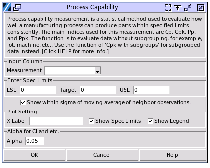
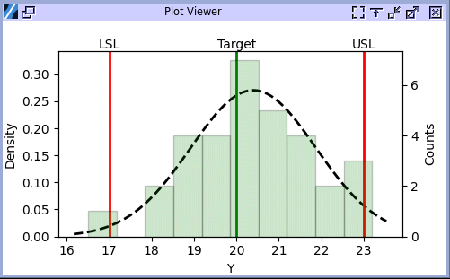
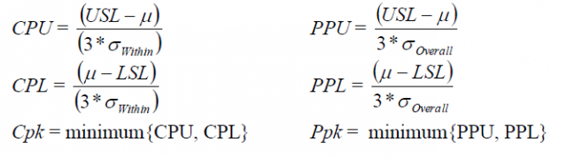

Process Capability
==================

Process capability measurement is a statistical method used to evaluate how well a manufacturing process can produce parts within specified limits consistently. The main indices used for this measurement are Cp, Cpk, Pp, and Ppk. The function is to evaluate data without subgrouping, for example, lot, machine, etc.. Use the function of `Cpk with subgroups` for subgrouped data instead.

Choose Quality > Process Capability

- **Measurement**: The column containing the measurement result. The values must be numerical and continuous. The caculation assumes the data following normal distribution. Nonnormal distribution evaluation is not available yet.
- **Spec Limits**: To perform the analysis, you must specify a lower (LSL) and upper (USL) specification limit to define your process requirements. Target of the process can also be specified. When leaving the Target value zero, the software will use the mean of LSL and USL as the target. 
- **Show within sigma**: This is a way to evaluate potential (within) capability. Without subgroups, the software will take a moving window of 2 data points to form the pseudo subgroups for the analysis.
- **Plot Settings**:

  - **X Label**: Customize the label of x axis. By default, the software will use the column name of the measurement input.
  - **Show Spec Limits**: Show vertical lines to mark the USL, LSL and Target in the plot. 
  - **Show Legend**: Legend will be only shown when `Show within Sigma` is enabled, by default. Use the selection to override. 

- **Alpha**: Set confidence interval range. For example CI range will be 95% when alpha is 0.05.

The result aligns with JMP 17.

Open the file `CPK_sample.pickle` in the sample data folder. Select `Measurement` with column `Y`. Set the LSL, USL and Target to 17, 23 and 20. The plot and results below will be displayed. 

The plot contains the histogram of the data and the normal distribution fit. The histogram bar charts uses the Y axis on the right hand side, which showing the counts of the data poionts falling into each bin. The normal distribution fit curve uses the Y axis on the left hand side, which is the probability density. In the meanwhile the probability density axis is also used by the histogram, it demonstrates the integrated probability of each bin.

.. code:: none

   ---- Process Capabilities ----
   LSL = 17.000
   USL = 23.000
   Target = 20.000
   mean = 20.397
   Overall Sigma = 1.475
   N = 32
   N Subgroups = 0
   
   Overall (AKA Ppk in JMP)
   +-------+----------+--------------+--------------+
   | Index | Estimate | Lower 95.00% | Upper 95.00% |
   +-------+----------+--------------+--------------+
   |  Cpk  |  0.588   |    0.402     |    0.775     |
   |  Cpl  |  0.768   |    0.543     |    0.988     |
   |  Cpu  |  0.588   |    0.400     |    0.772     |
   |   Cp  |  0.678   |    0.510     |    0.846     |
   |  Cpm  |  0.655   |              |              |
   +-------+----------+--------------+--------------+
   
   Nonconformance (Observation and Expected)
   +-----------+-----------+-------------------+
   |  Portion  | Observed% | Expected Overall% |
   +-----------+-----------+-------------------+
   | Below LSL |    3.12   |        1.06       |
   | Above USL |    3.12   |        3.88       |
   | Total Out |    6.25   |        4.94       |
   +-----------+-----------+-------------------+

The first part of the numerical prints includes general information of the study. The `Overall Sigma` is the standard deviation of the sample data. `N subgroups` is zero here because the study didn't contain subgroups of data.

**Cp (Process Capability)**

- Measures the **potential capability** of a process to produce output within specification limits, assuming the process is centered
- Formula:
  
  .. math::
  
     Cp = \frac{USL - LSL}{6\sigma}

  where:
  - :math:`USL` = Upper Specification Limit
  - :math:`LSL` = Lower Specification Limit
  - :math:`\sigma` = process standard deviation

**Cpk (Process Capability Index)**

Use Cpk to evaluate the capability of your process based on both the process location and the process spread. The capability indicates the actual performance of your process that your customer experiences over time.

Generally, higher Cpk values indicate a more capable process. Lower Cpk values indicate that your process may need improvement.

- Measures **actual capability** by considering both process variation and centering
- Formula:
  
  .. math::
  
     Cpk = \min\left(\frac{USL - \mu}{3\sigma}, \frac{\mu - LSL}{3\sigma}\right)

  where :math:`\mu` = process mean

**Cpu (Upper Capability Index)**

- Evaluates **upper specification limit** performance:
  
  .. math::
  
     Cpu = \frac{USL - \mu}{3\sigma}

**Cpl (Lower Capability Index)**

- Evaluates **lower specification limit** performance:
  
  .. math::
  
     Cpl = \frac{\mu - LSL}{3\sigma}

**Cpm (Process Capability Index for Target)**

Cpm is a measure of the overall capability of the process. Cpm compares the specification spread to the spread of your process data while taking into account how much the data deviate from the target value.

- Incorporates **deviation from target value** (T):
  
  .. math::
  
     Cpm = \frac{USL - LSL}{6\sqrt{\sigma^2 + (\mu - T)^2}} 

- Penalizes processes where mean (μ) deviates from target (T). This formula ensures that processes with means far from the target—even if within specification limits—receive lower capability scores. For example, in industries like pharmaceuticals or manufacturing, where precise alignment with a target (e.g., drug dosage or part dimensions) is critical, Cpm helps identify processes that may meet tolerances but are suboptimally centered. A higher Cpm indicates not only reduced variability but also better adherence to the desired target, making it a stricter measure than Cp or Cpk for processes requiring exact alignment 

The overall Cpk is also called as Ppk, for example in Minitab. The difference of Cpk and PpK lies in which sigma value was used in the caculation. Cpk or Cpk (within) uses the standard deviation, i.e. Sigma, of the subgroups, while the overall Cpk or Ppk uses the overall sigma that is the standard deviation of all the sample points. This difference applies to all other capability indices too.

Nonconformance in process capability analysis refers to products or processes that fail to meet specified requirements. The result includes the stats of falling out of the upper and lower limites, and the total as well. The observed values indicate the portion of sample data that do not meet spec limits. The expected values are the estimate from the fitted normal distribution, which are the portion of the population that falling out of the limits, assuming population following the distribution fitted.

When the `Show within sigma` option being checked, the software will use each pair of the neibhour data point to caculate standard deviation and use the average of the values to be the with subgroup sigma. The caculation requires that the data possesses a chronological order.

The within sigma will be discussed in the next session. 
