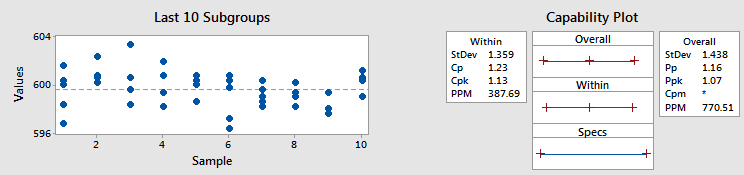

Process Capability with Subgroups
---------------------------------

A process capability study evaluates whether a manufacturing process can consistently produce outputs within specified tolerance limits by analyzing indices like Cp, Cpk, and Cpm. The study with Subgroups focuses on the measurement with different lot, shift, equipment or operators etc. The study will show the repeatability within these Subgroups, for example repeatability of the day shift instead of the overall production line.

To perform the study choose Quality > Process Capability with Subgroups

- **Measurement**: The column containing the measurement result. The values must be numerical and continuous. The caculation assumes the data following normal distribution. Nonnormal distribution evaluation is not available yet.
- **Spec Limits**: To perform the analysis, you must specify a lower (LSL) and upper (USL) specification limit to define your process requirements. Target of the process can also be specified. When leaving the Target value zero, the software will use the mean of LSL and USL as the target. 
- **Subgroup**: Set the method to categorize the measurement data into Subgroups.

  - **Option 1: Use Subgroup Size**: Select **Use Subgroup Size** in **Option**, and set the size of each group in **Subgroup Size**. In this case each sub group has to have the same number of sample points. Each sub group will be extracted from the pool sequentially.
  - **Option 2: Use Subgroup ID**: In this case, there shall be a column containing the categorical data for the measurement data points. Select **Use Subgroup ID Col.** in **Option**, and select the column in **ID Col.**. The setting in **Subgroup Size** will be ignored in this case, and vise versa. 

- **Within Subgroup Variation**: Select the approach to estimate the within Subgroup sigma.
  
  - **Average of Unbiased SD**: Use the average of the standard deviation of each sub group divided by its C4 value.
  - **Average of Ranges**: The approach uses range of each group to estimate the underlying data population. The approach is more sensitive to outliers. 

- **Plot Settings**:
  
  - **X Label**: Customize the label of x axis. By default, the software will use the column name of the measurement input.
  - **Show Spec Limits**: Show vertical lines to mark the USL, LSL and Target in the plot. 
  - **Show Legend**: Legend of the curves of the overall and within distribution fitting.

- **Alpha**: Set confidence interval range. For example CI range will be 95% when alpha is 0.05.

The result aligns with JMP 17.

The plot below demenstrates the result from the data set `CPK_sample.pickle` in the sample data folder. Select `Measurement` with column `Y`. Set the LSL, USL and Target to 17, 23 and 20. Select `Subgroup` with `Use Subgroup ID` and column `Lot` as the Subgroup ID. Keep the `Within Subgroup Variation` as `Unbiased SD` unchanged.

The plot contains the histogram of the data and the normal distribution fit. The histogram bar charts uses the Y axis on the right hand side, which showing the counts of the data poionts falling into each bin. The normal distribution fit curve uses the Y axis on the left hand side, which is the probability density. In the meanwhile the probability density axis is also used by the histogram, it demonstrates the integrated probability of each bin. The narrower curve is the normal distribution fit of the within sigma. It shows the inner subgroup process capability regardless the inter subgroup difference. 

.. code:: none
  
  ---- Process Capabilities ----
  LSL = 17.000
  USL = 23.000
  Target = 20.000
  mean = 20.397
  Within Sigma = 1.052
  Overall Sigma = 1.475
  N = 32
  N Subgroups = 8
  Stability Index = 1.402
  Within sigma estimated by the average of unbiased SD.
  
  Within
  +-------+----------+--------------+--------------+
  | Index | Estimate | Lower 95.00% | Upper 95.00% |
  +-------+----------+--------------+--------------+
  |  Cpk  |  0.825   |    0.558     |    1.092     |
  |  Cpl  |  1.077   |    0.742     |    1.408     |
  |  Cpu  |  0.825   |    0.557     |    1.089     |
  |   Cp  |  0.951   |    0.675     |    1.227     |
  |  Cpm  |  0.890   |              |              |
  +-------+----------+--------------+--------------+
  
  Overall (AKA Ppk in JMP)
  +-------+----------+--------------+--------------+
  | Index | Estimate | Lower 95.00% | Upper 95.00% |
  +-------+----------+--------------+--------------+
  |  Cpk  |  0.588   |    0.402     |    0.775     |
  |  Cpl  |  0.768   |    0.543     |    0.988     |
  |  Cpu  |  0.588   |    0.400     |    0.772     |
  |   Cp  |  0.678   |    0.510     |    0.846     |
  |  Cpm  |  0.655   |              |              |
  +-------+----------+--------------+--------------+
  
  Nonconformance (Observation and Expected)
  +-----------+-----------+------------------+-------------------+
  |  Portion  | Observed% | Expected Within% | Expected Overall% |
  +-----------+-----------+------------------+-------------------+
  | Below LSL |    3.12   |       0.06       |        1.06       |
  | Above USL |    3.12   |       0.67       |        3.88       |
  | Total Out |    6.25   |       0.73       |        4.94       |
  +-----------+-----------+------------------+-------------------+
  

The first part of the numerical prints includes general information of the study. The `Overall Sigma` is the standard deviation of the sample data. `N subgroups` is the number of subgroups. 

`Stability Index` is a measure of stability of the process. A stable process has a stability index near one. Higher values indicate less stability. The stability index is defined as follows: (Overall Sigma / Within Sigma). In the ideal case without any inter subgroup difference, the index shall be 1. In real practics, the index is greater than one, but the less the better.

All the indices in the study are same to the previous session, but including the within subgroup indices. The overall Cpk is also called as Ppk, for example in Minitab, while the overall Cpk or Ppk uses the overall sigma that is the standard deviation of all the sample points. This difference applies to all other capability indices too.

.. image:: images/cpk_ppk_formulas_w640.png
   :align: center

Using subgroup data is always a good approach to understand the process potential, by removing one source of variation, which is the grouping factor. For example, a data set having subgrouping via equipment, if the result of within subgroup is much better than the overall result, demonstrates that the process repeatability can be improved by using less equipment, or reducing the inter equipment difference.

Here is a hyperthetical example of within subgroup capability VS the overall capability.

Hyperthetically let's say the data were grouped by lots. As illustrated in the left-side graph, the shift and drift between subgroups are minimal compared to the variation within the subgroups themselves. Consequently, the within-subgroup and overall standard deviations are nearly identical, resulting in closely matched within Cpk and overall Cpk values (1.13 and 1.07, respectively). [ref. `LINK <https://blog.minitab.com/en/process-capability-statistics-cpk-vs-ppk>`_]
   

But if the same data points were regrouped, for example by operators, the within within subgroup Cpk can go up to 3.7. Using within subgroup indices helped to identify the main variation source of the process is operators. Potentially more training or alignment of their workstation may improve the overall process capability.

In the previous session, when the data do not have any subgrouping, a moving window can still be applied to a sequentially recorded data set for within sigma. The algorithm uses the pairs of neighor data points as the subgroups. It assumes the production condition and environment change less during a short of period time. But if over the entire time span the condition drifts much, the within indices will be much better than the overall indices. In this case, a control chart will come to handy for further process drifting analysis, which will be discussed in the next session.

