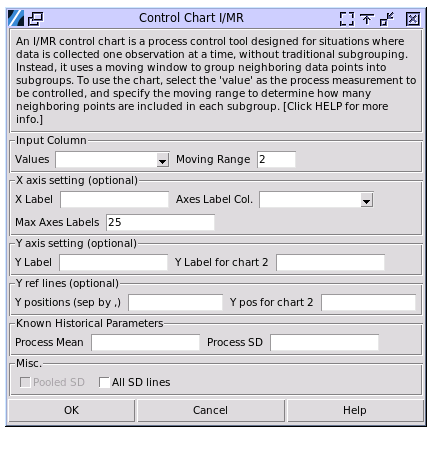

Control Chart I/MR
==================

A control chart is a valuable tool for monitoring process stability, as it indicates when your process is out of control and helps identify the presence of special-cause variation. When special-cause variation occurs, it means the process is not stable and corrective action is required to address the underlying issues.

Control charts are graphical representations that plot process data in a time-ordered sequence. Typically, these charts feature a center line representing the process mean, along with upper and lower control limits that reflect the process variation. By default, the control limits are set at distances of three standard deviations (3σ) above and below the center line, providing a clear visual boundary for expected process behavior.

An I/MR control chart, also known as the Individuals and Moving Range chart, is a statistical process control tool used to monitor processes where data is collected one observation at a time rather than in subgroups. This dual-chart approach is particularly valuable when subgrouping data is impractical. 

To perform the study, choose Quality > Control Chart I/MR

- **Input Column**

  - **Values**: The column containing the process measurement to control. The values should be numerical, continous, and in chronological order.
  - **Moving Range**: The moving window size to cover consecutive data points to be included into the pseudo subgroups.

- **X axis setting**: 

  - **X Label**: The label of x-axis. By default, the label is the name of the measurement data column.
  - **Axis Label Column**: By default the x axis ticks will be labelled with numerical order of the data points, to specify the labels to, for example, production time, select the column containing the information. The label column should have same number of data points as the measurement column.
  - **Max Axes Labels**: When there are a large number of data points, using the setting to customize how many x axis tick label shall be displayed. 

- **Y Axis Setting**: Customize y axis labels. The first setting is for the chart on the top. The second setting is for the bottom one.
- **Y Ref Lines**: The additional reference lines to be displayed on the charts. The first setting is for the chart on the top. The second setting is for the bottom one. Seperate mutliple values by comma.
- **Known Historical Parameters**:

  - **Process Mean**: The mean of the measurement from historical data. If left blank the study will calculate the mean value from the given data. Use the input when the process data are less and expected to follow the previous observations.
  - **Process SD**: The standard deviation of the measurement from historical data. If left blank the study will calculate the value from the given data. Use the input when the process data are less and expected to follow the previous observations. The standard deviation and mean do not need be inputted together.

- **All SD Lines**: By default only limit lines of +/- 3 sigma will be displayed. Use this option to display 1 sigma and 2 sigma limits.

