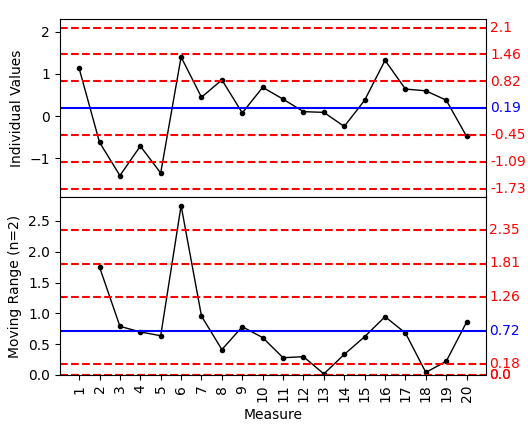

Control Chart I/MR
==================

A control chart is a valuable tool for monitoring process stability, as it indicates when your process is out of control and helps identify the presence of special-cause variation. When special-cause variation occurs, it means the process is not stable and corrective action is required to address the underlying issues.

Control charts are graphical representations that plot process data in a time-ordered sequence. Typically, these charts feature a center line representing the process mean, along with upper and lower control limits that reflect the process variation. By default, the control limits are set at distances of three standard deviations (3σ) above and below the center line, providing a clear visual boundary for expected process behavior.

An I/MR control chart, also known as the Individuals and Moving Range chart, is a statistical process control tool used to monitor processes where data is collected one observation at a time rather than in subgroups. This dual-chart approach is particularly valuable when subgrouping data is impractical. 

To perform the study, choose Quality > Control Chart I/MR

.. image:: images/ctrl_chart_imr1.png
   :align: center

- **Input Column**

  - **Values**: The column containing the process measurements to control. The values should be numerical, continuous, and in chronological order.
  - **Moving Range**: The moving window size to cover consecutive data points to be included in the pseudo subgroups.

- **X axis setting**: 

  - **X Label**: The label for the x-axis. By default, the label is the name of the measurement data column.
  - **Axis Label Column**: By default, the x-axis ticks will be labeled with the numerical order of the data points. To specify custom labels (for example, production time), select the column containing the information. The label column should have the same number of data points as the measurement column.
  - **Max Axes Labels**: When there are a large number of data points, use this setting to customize how many x-axis tick labels should be displayed. 

- **Y Axis Settings**: Customize y-axis labels. The first setting is for the top chart. The second setting is for the bottom chart.
- **Y Ref Lines**: Additional reference lines to be displayed on the charts. The first setting is for the top chart. The second setting is for the bottom chart. Separate multiple values by commas.

- **Known Historical Parameters**:

  - **Process Mean**: The mean of the measurements from historical data. If left blank, the study will calculate the mean value from the given data. Use this input when the process data are limited and expected to follow previous observations.
  - **Process SD**: The standard deviation of the measurements from historical data. If left blank, the study will calculate the value from the given data. Use this input when the process data are limited and expected to follow previous observations. The standard deviation and mean do not need to be input together.

- **All SD Lines**: By default, only limit lines of ±3 sigma will be displayed. Use this option to display 1 sigma and 2 sigma limits as well.

For valid control chart results, ensure your data meets these criteria: use continuous data (not counts of defectives/defects, which require attribute control charts like P Chart or U Chart), maintain chronological order with oldest data at the top, collect observations at equally spaced time intervals appropriate for detecting process changes, use individual observations rather than subgroups (use Xbar-R or Xbar-S charts for subgrouped data), ensure the data is moderately normal, and verify that observations are not correlated with each other.

Open the sample data `ctrl_chart_imr.pickle` in the `sample_data` folder. In the Control Chart I/MR dialog, select `Measure` as the Input Column Values, check `All SD Lines` and keep other options by default. The result is as below.

The top chart shows the individual measurements, and the bottom chart shows the moving range. The center line of the top chart is the process mean, and the center line of the bottom chart is the moving range mean. The control limits are 3 sigma above and below the center line. After turning on the option to show all standard deviation lines and the chart area being split into several zones. Zone C is the zone closest to the average.  It represents the area from the average to one sigma above the average.  There is a corresponding zone C below the average.  Zone B is the zone from one sigma to two sigma above the average.  Again, there is a corresponding Zone B below the average. Zone A is the zone from two sigma to three sigma above the average as well as below the average.

To interpret the charts, the first step is to check the moving range chart at the bottom and identify any points that exceed the 3-sigma limits. For example, in the dataset, the difference between the fifth and sixth observations is large and exceeded the upper limit. This point will be treated as an out-of-control point for the process.

Secondly, examine the individual chart using selected rules. The most commonly used rule is that no points should exceed the upper and lower 3-sigma lines. However, there are 8 rules total, and not all rules have to be applied or met for the process to be considered in control.

The Western Electric Rules
--------------------------

The Western Electric Rules provide a comprehensive framework for detecting out-of-control conditions. These rules help identify patterns that indicate the process may be out of statistical control, even when individual points fall within the control limits.

**Western Electric Rules for Out-of-Control Detection:**

1. **Beyond Limits** - One or more points beyond the control limits

2. **Zone A** - 2 out of 3 consecutive points in Zone A or beyond

3. **Zone B** - 4 out of 5 consecutive points in Zone B or beyond

4. **Zone C** - 7 or more consecutive points on one side of the average (in Zone C or beyond)

5. **Trend** - 7 consecutive points trending up or trending down

6. **Mixture** - 8 consecutive points with no points in Zone C

7. **Stratification** - 15 consecutive points in Zone C

8. **Over-control** - 14 consecutive points alternating up and down

These rules help identify patterns that indicate the process may be out of statistical control, even when individual points fall within the control limits.

