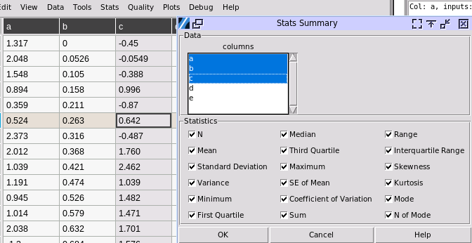

Describe MultiVar
-----------------

Choose Stats>Describe MultiVar. This calculates the same statistical summary upon multiple sets of data, i.e., multiple columns.

- **Data column:** One or multiple column names can be selected using left click to toggle selection, and also combining with CTRL and SHIFT.

- **Statistics**: Toggle each statistical item that will be printed out in output.

A sample output:

.. image:: images/multides2.png
   :align: center
