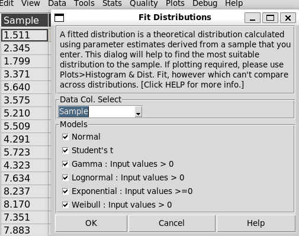
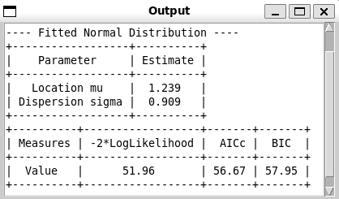
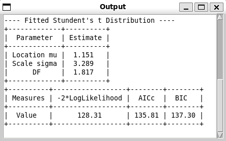
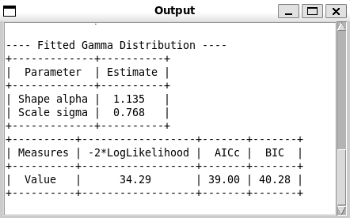
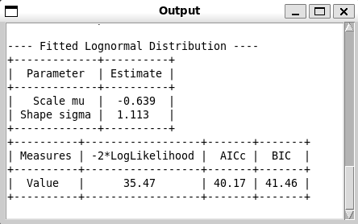
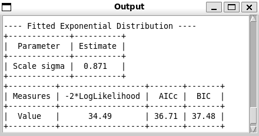
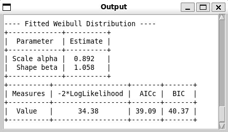
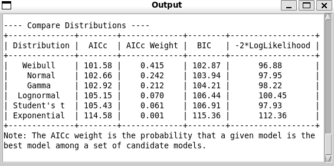

Fit Distributions
-----------------

Choose Stats>Fit Distributions.

A fitted distribution is a theoretical distribution calculated using parameter estimates derived from a sample that you enter. This dialog can help to find the most suitable distribution to the sample. If plotting required, please use Plots>Histogram & Dist. Fit, however which can't compare across distributions.

- **Data Col. Select:** Select the sampled dataset, i.e. a column of data. 
- **Models:** Select the distributions to test with. Please note some distributions require input values all positive or non-negative.

The backend of the fitting is scipy. It provides very close results to JMP 17, in 3 to 4 significant digits. The output format and parameter selection follow JMP. The output doesn't inlcude CI and standard errors.

A sample output:

- **Normal:** The location mu is the mean of the normal distribution, while dispersion sigma is standard deviation. The terminology aligns with JMP, same as below. The probability density function of the normal distribution is :math:`f(x) = \frac{1}{\sigma\sqrt{2\pi}} e^{-\frac{(x-\mu)^2}{2\sigma^2}}`.

  - f(x) is the probability density function
  - x is the variable (the value on the x-axis)
  - μ (mu) is the mean of the distribution
  - σ (sigma) is the standard deviation of the distribution 

- **Student's t:** The probability density function of the Student's t-distribution is :math:`f(x) = \frac{\Gamma(\frac{\nu+1}{2})}{\Gamma(\frac{\nu}{2}) \sigma\sqrt{\nu\pi}} \left[1 + \frac{1}{\nu}\left(\frac{x-\mu}{\sigma}\right)^2\right]^{-\frac{\nu+1}{2}}`.
  
  - When μ = 0 and σ = 1, this reduces to the standard Student's t-distribution.
  - The location parameter μ shifts the distribution along the x-axis.
  - The scale parameter σ stretches or shrinks the distribution.
  - As DF :math:`\nu` (degrees of freedom) approaches infinity, the t-distribution approaches a normal distribution. 
    
    - When DF > 30, the distribution will approach a normal distribution. 
    - A very large DF indicates that normal distribution may fit better to the samples. 
    - The sample data file "dists.pickle" in "sample_data" directory contains student's t sample data, which is good for testing this fit.
      
  - For small DF, the t-distribution has heavier tails than the normal distribution.
  - The t-distribution is symmetric about its location parameter μ.

- **Gamma:** The probability density function of the Gamma distribution is :math:`f(x; \alpha, \sigma) = \frac{x^{\alpha - 1} e^{-x/\sigma}}{\sigma^{\alpha} \Gamma(\alpha)} \quad \text{for } x > 0, \, \alpha > 0, \, \sigma > 0`.
  
  - α (Shape Parameter): Determines the shape of the distribution. Larger values of α result in a distribution that is more symmetric and less skewed.
  - σ (Scale Parameter): Stretches or compresses the distribution along the x-axis. Larger values of σ spread out the distribution.

- **Lognormal:** If X is lognormally distributed, then Y = ln(X) has a normal distribution with mean μ (scale mu) and variance σ^2 (shape sigma). The probability density function of the lognormal distribution is :math:`f(x; \mu, \sigma) = \frac{1}{x\sigma\sqrt{2\pi}} \exp\left(-\frac{(\ln x - \mu)^2}{2\sigma^2}\right) \quad \text{for } x > 0`.

- **Exponential:** The exponential distribution models the time between events in a Poisson process, where events occur continuously and independently at a constant average rate. σ (sigma) is the scale parameter, which is equal to 1/λ, which is usually called rate parameter. The probability density function of the exponential distribution is :math:`f(x; \sigma) = \frac{1}{\sigma} \exp\left(-\frac{x}{\sigma}\right) \quad \text{for } x \geq 0, \, \sigma > 0`.

- **Weibull:** The Weibull distribution is a flexible continuous probability distribution used to model a wide variety of data, especially in reliability engineering and life data analysis. `WIKI <https://en.wikipedia.org/wiki/Weibull_distribution>` The probability density function of the Weibull distribution is :math:`f(x; \beta, \eta) = \frac{\beta}{\eta} \left(\frac{x}{\eta}\right)^{\beta-1} \exp\left(-\left(\frac{x}{\eta}\right)^\beta\right) \quad \text{for } x \geq 0, \, \beta > 0, \, \eta > 0`.
  
  - β (beta) is the shape parameter
  - η (eta) is the scale parameter
  - The Weibull distribution can take on the characteristics of other distributions based on its shape parameter:
    
    - β < 1: Decreasing failure rate (similar to exponential)
    - β = 1: Constant failure rate (becomes exponential distribution)
    - β > 1: Increasing failure rate
    - β ≈ 3.6: Approximates normal distribution

When comparing distribution fits, several criteria are commonly used to evaluate and select the best model. Here's an explanation of AICc, BIC, AICc Weight, and -2*loglikelihood:

1. **AICc (Corrected Akaike Information Criterion):**

   AICc is a corrected version of the Akaike Information Criterion (AIC) that is better suited for small sample sizes. The formula for AICc is:

   :math:`\text{AICc} = \text{AIC} + \frac{2k^2 + 2k}{n - k - 1}`

   Where:
   - :math:`\text{AIC} = 2k - 2\ln(L)`
   - *k* is the number of parameters in the model
   - *n* is the sample size
   - *L* is the maximum likelihood estimate

   AICc penalizes models with more parameters to prevent overfitting. Lower AICc values indicate better model fit.

2. **BIC (Bayesian Information Criterion):**

   BIC is similar to AIC but penalizes model complexity more strongly. The formula for BIC is:

   :math:`\text{BIC} = k \ln(n) - 2\ln(L)`

   Where:
   - *k* is the number of parameters
   - *n* is the sample size
   - *L* is the maximum likelihood estimate

   Like AICc, lower BIC values indicate better model fit.

3. **AICc Weight:**

   AICc weight is a measure of the relative likelihood of a model being the best among a set of candidate models. It's calculated as:

   :math:`w_i = \frac{\exp(-0.5 \cdot \Delta_i)}{\sum \exp(-0.5 \cdot \Delta_j)}`

   Where:
   - :math:`\Delta_i` is the difference between the AICc of model *i* and the minimum AICc in the set
   - The sum in the denominator is over all models in the set

   AICc weights sum to 1 across all models. Higher weights indicate stronger support for a model.

4. **-2*loglikelihood:**

   This is simply -2 times the natural logarithm of the likelihood function. It's used in calculating both AIC and BIC. Lower values indicate better fit.

   :math:`-2\cdot loglikelihood = -2\ln(L)`

When comparing models:

- AICc and BIC balance goodness of fit with model complexity.
- AICc Weight provides a relative measure of model support.
- -2*loglikelihood focuses solely on goodness of fit without penalizing complexity.

These AICc Weight is used in JMP in selecting the most appropriate distribution fit, when multiple fits involved.

    
