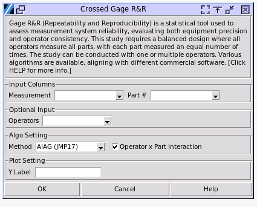
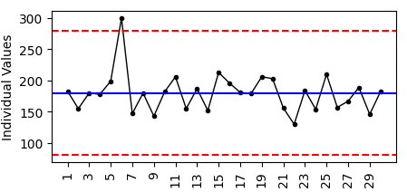

.. raw:: html

   

Crossed Gage R&R
================

Gage R&R (Repeatability and Reproducibility) is a statistical technique used to assess the reliability and consistency of a measurement system. It helps determine how much of the observed variation in measurements is due to the measurement system itself versus actual differences in the items being measured. Repeatability refers to the variation in measurements taken by the same person using the same instrument on the same part multiple times. Reproducibility is the variation in measurements taken by different people using the same instrument on the same part.

A crossed study is the most common type of Gage R&R study, most often used where we are able to instruct each operator to measure each part a fixed number of times. These must be continuous measurements, which means that the result is a number on a scale, as opposed to an attribute gage which gives a Go/No-Go result.

Besides crossed Gage R&R, there are nested GRR and expanded GRR. Nested GR&R is primarily used for destructive testing, where each operator measures different parts. Expanded GR&R builds upon either crossed or nested designs by incorporating additional factors beyond just operators and parts, such as different measurement equipment or environmental conditions.

Crossed Gage R&R requires that operators measure parts in a random order, ensuring the selected parts represent the actual or expected range of process variation. Every operator must evaluate every part, and for optimal results, the study should include 3 to 5 operators, though fewer than 3 may be used if that reflects the actual number of operators using the measurement system. Meanwhile, each operator must measure each part the same number of times, no less than two, to maintain consistency and reliability in the study. About design of the study and how the numbers of replicates, part and operators impact the result, there is a white paper from Minitab. `LINK <http://https://github.com/garrydu/Minijmp/blob/main/docs/ext/GageRRWhitePaper.pdf>`_

To perform the study, choose Quality > Crossed Gage R&R

- **Measurement**: The column containing the measurement result. The values must be numerical. 
- **Part**: The column containing the part number. The values will be treated as categorical. 
- **Operators**: When the study has multiple operators, select the column with the operator indicator. The values will be treated as categorical.
- **Algo setting / Method**: There are 3 different algorithms available for the study. The EMP and AIAG methods align with Minitab 22 and JMP 17 (may show small differences to JMP results on some corner cases). The Xbar/R method is a tranditional approach to calculate variation of the sources, whose evaluation approach is AIAG. 
- **Operator x Part Interaction**: Whether to include the interaction as a source of variation. Two way ANOVA study can be used to determine whether to include this item, which will be discussed.
- **USL - LSL**: The allowed tolerance by the spec, which is the difference between the upper limit of the spec and lower limit of the spec. This value can be used to calculate the ratio with the measurement variations. When you enter the tolerance range, a %Tolerance column in a table will be displayed.
- **Historical SD**: Enter a known value for the total variation, which is the part-to-part variation plus the measurement system variation. A %Process column in a table will be displayed.
- **Plot Y Label**: Set the Y label for the distribution chart plotted. By default it uses the column name of measurement as the Y axis label.
- **Alpha Value**: Set the Alpha value to determine if to remove the interaction term when the auto mode was selected.

All the crossed Gage R&R algorithms here require a balanced design of study, which means that each operator has to measure all the parts with the same number of replicates. Here is a guideline for the study design. `LINK <https://support.minitab.com/en-us/minitab/help-and-how-to/quality-and-process-improvement/measurement-system-analysis/how-to/gage-study/crossed-gage-r-r-study/before-you-start/data-considerations/>`_ 

AIAG (ANOVA)
------------

AIAG (Automotive Industry Action Group) Gage R&R is a standardized method for assessing measurement system capability in the automotive industry originally. It is now widely used as a standard for GRR outside of the auto industry too. In the days of manual calculation, the average/range way was used, which is the Xbar/R method in the selection. However, the calculation now uses two way ANOVA which is type III sum of squares. 

The type III method is relatively new. The JMP 17 and Minitab 22 are using the method by default for GRR studies. The method here aligns with JMP 17 measurement system analysis > Gage R&R > crossed. The Minitab 22 has it at Gage study > Gage R&R crossed. The backbone algo of type III SS has slight difference in JMP 17 and Minitab 22. In most of the cases, both commercial softwares have the identical results, except for some extreme set ups, like the interaction term is much larger than operator variation. The software fully aligns with Minitab 22.

Open the sample data file `gasket.pickle`, select `Measurement` by `Y`, operators and parts. Set `Operator x Part Interaction` to `Off`. The result is below. 

.. code-block:: none

   ---- GRR AIAG (ANOVA) ----
   Gage Evaluation
   +---------------------+---------+---------+--------+
   |        Source       | Std Dev |  6 x SD |  %SV   |
   +---------------------+---------+---------+--------+
   |    Ttl GRR(EV&AV)   |  5.654  |  33.926 | 23.83  |
   |  EV(repeatability)  |  3.528  |  21.168 | 14.87  |
   | AV(reproducibility) |  4.419  |  26.513 | 18.63  |
   |       Operator      |  4.419  |  26.513 | 18.63  |
   |   PV(Part to Part)  |  23.041 | 138.246 | 97.12  |
   |   Total Variation   |  23.725 | 142.348 | 100.00 |
   +---------------------+---------+---------+--------+
   Gage R&R / Total Variation = 23.8%
   Number of Distinct Categories = 5
   
   Variance Components of GRR
   +-----------------+--------+---------+---------------+
   |      Source     |   SD   | VarComp | %Contribution |
   +-----------------+--------+---------+---------------+
   |     Ttl GRR     | 5.654  |  31.972 |      5.68     |
   |  Repeatability  | 3.528  |  12.446 |      2.21     |
   | Reproducibility | 4.419  |  19.525 |      3.47     |
   |   Product Var.  | 23.041 | 530.889 |     94.32     |
   +-----------------+--------+---------+---------------+
   
   
The results show the contribution of the variability of different sources in the measurement. The standard deviation is an important value for each source's analysis. All GRR analysis is based on these values. They are also useful for offline comparison for other purposes.
   
- **Total Gage R&R**: The sum of the repeatability and the reproducibility variance components.
- **Repeatability**: The variability in measurements when the same operator measures the same part multiple times, which is the variation introduced by the equipment.
- **Reproducibility**: The variability in measurements when different operators measure the same part, which includes the viriation introduced by operators, and the variation that is from the operator and part interaction. An interaction exists when an operator measures different parts differently. The variance of the term is the sum of `Operator` variance and `Operator x Part Interaction` variance (discuss later).
- **Product Variation**: also known as Part-to-Part variation, it is the variability introduced by the part producing.

In the **Gage R&R Evaluation** table, the `6 x SD` shows the range approximately 99.7% samples fall within, which is also the **Study Variation**. `%SV` shows the ratio of study variation of each source to the total variation. 

In **Variance Components** table, the `VarComp` is variance that is squares of SD. The `%Contribution` is the portion of each source's contribution in the total variance that is sum of `TTL GRR` and `Product Variance`.

Ideally, very little of the variability should be due to repeatability and reproducibility. Differences between parts (Part-to-Part) should account for most of the variability.

There are two indicators telling if the measurement system is acceptable. One is the **Gage R&R / Total Variation** under the first table; and the other is the **%Contribution of TTL GRR** in the second table. 

According to AIAG guidelines, the criteria are listed below. The **Gage R&R / Total Variation** is calculated with the standard deviation of the gage system and total variation. The **%Contribution** is calculated with the variances of these values. The two values are in the square relationship. The **%Contribution** is recommended, though using either of them for the judgement gives the same category.

.. list-table:: Measurement System Acceptability Criteria
   :header-rows: 1
   :widths: 30 30 40
   :class tight-table

   * - Percentage of Process Variation
     - Percentage of variance components
     - Acceptability
   * - Less than 10%
     - Less than 1%
     - The measurement system is acceptable.
   * - Between 10% and 30%
     - Between 1% and 9%
     - The measurement system is acceptable depending on the application, the cost of the measurement device, cost of repair, or other factors.
   * - Greater than 30%
     - Greater than 9%
     - The measurement system is not acceptable and should be improved.

The **Number of Distinct Categories** (NDC) is another key metric in a Gage R&R study that evaluates a measurement system's ability to differentiate between varying levels of variability in the measured characteristic. It indicates the number of non-overlapping confidence intervals that span the range of product variation, providing insight into the system's resolution and effectiveness.

The interpretation of NDC values is as follows: If the NDC is less than 2, the measurement system lacks the capability to distinguish between parts, indicating poor resolution. An NDC between 2 and 4 suggests a limited ability to detect variability, meaning the system can differentiate parts but with significant constraints. For most applications, an NDC of 5 or greater is considered acceptable, as it demonstrates the measurement system's ability to reliably distinguish between parts and effectively capture variability, according to AIAG manual.

EMP Method
----------

EMP in GRR stands for Evaluating the Measurement Process. It is an alternative approach to analyzing measurement system capability, developed by Dr. Donald Wheeler. Comparing to AIAG, it is a newly developed method. The method gives a more comprephensive way to evaluate the measurement system, rather than acceptable / unacceptable binary result from AIAG method. It commends a method to use a measurement system with control charts, which is unacceptable in AIAG evaluation.

The EMP algorithm to achieve variations of the sources is still ANOVA, which is type III sum of squares. The standard deviation of sources in EMP method is the same to what AIAG ANOVA gives. The only difference is how to use the standard deviation values to evaluate the measurement system. 

Open the sample data file `gasket.pickle`, select `Measurement` by `Y`, operators and parts. Set `Operator x Part Interaction` to `Off`. The result is below. 

.. code-block:: none

   ---- GRR EMP (ANOVA) ----
   Variance Components
   +-----------------+---------+---------+---------------+
   |      Source     | Std Dev | VarComp | %Contribution |
   +-----------------+---------+---------+---------------+
   |     Ttl GRR     |  5.654  |  31.972 |      5.68     |
   |  Repeatability  |  3.528  |  12.446 |      2.21     |
   | Reproducibility |  4.419  |  19.525 |      3.47     |
   |   Product Var.  |  23.041 | 530.889 |     94.32     |
   | Total Variation |  23.725 | 562.861 |     100.00    |
   +-----------------+---------+---------+---------------+
   
   EMP Statistics
   +------------------------------------+-------+----------------+
   | Statistic                          | Value | Classification |
   +------------------------------------+-------+----------------+
   | Test-retest error                  | 3.528 |                |
   | Degrees of freedom                 |   23  |                |
   | Probable error                     | 2.380 |                |
   | Intraclass Correlation (no bias)   | 0.977 |  First Class   |
   | Intraclass Correlation (with bias) | 0.943 |  First Class   |
   | Bias Impact                        | 0.034 |                |
   +------------------------------------+-------+----------------+
   

The `Variance Components` table stays the same to the AIAG ANOVA method, while their back bone algorithm is identical. The `EMP Statistics` table is using different naming on the source variance and ratios.

- **Test-retest error**: It's the standard deviation of equipment variation, which is repeatability.
- **Degrees of Freedom**: The total degrees of freedom of this measurement study. Higher degrees of freedom results in narrower confidence intervals and more precise estimates.
- **Probable error**: It equals to 0.674490 times **test-retest erro**. The value corresponds to the range of 50% normally distributed data fall in. The purpose of the value in EMP is that it's easier to remember than the range within one standard deviation which has 67% data fall in. For example a measurement value of 167.00 has +/-2.38 as the range where the true value falls in with 50% probability.
- **Intraclass Correlation (no bias)**: It's a ratio of product variance (square of part-to-part SD) and the sume of product variance and equipment variance. The **bias** here refers variability brought by operators, which is not equipment bias.
- **Intraclass Correlation (with bias)**: It'a a ratio of product variance and the sume of product variance, operator variance and equipment variance. 
- **Bias Impact**: The difference between the two ratios above, with and without operator variance in the denominator of the ratios.

.. code-block:: none

   Classification Guidelines
   
   Classification    Intraclass     Attenuation of    Probability     Probability of
                    Correlation    Process Signals    of Warning,     Warning, Tests*
                                                      Test 1*
   ----------------------------------------------------------------------------------
   First Class      0.80 - 1.00    Less than 11%     0.99 - 1.00     1.00
   Second Class     0.50 - 0.80    11 - 29%          0.88 - 0.99     1.00
   Third Class      0.20 - 0.50    29 - 55%          0.40 - 0.88     0.92 - 1.00
   Fourth Class     0.00 - 0.20    More than 55%     0.03 - 0.40     0.08 - 0.92
   
   * Probability of detecting a three-standard-deviation shift within 10 subgroups 
     using test 1 or tests 1, 5, 6, and 8 of Nelson's Control Chart Rules. 

Classification is the core of the EMP. The method gives ratings to the **Intraclass Correlation**, i.e. the ratio of the variances. In the `EMP Statistics` the intraclass correlations are determined to levels by the classification ranges of the first column. The EMP evaluation created its own naming system to the statistics GRR, please note. Which intraclass correlation should be used it depends, but recommended using the one with bias, if part x operator interaction considered, using the one with bias and interaction. Because the term considered the variation in total gage R&R and equals to the **%Contribution of Product Variance** in the `Variance Components` table in AIAG analysis.

Product variance %Contribution equals to 100% minus total GRR %Contribution in the AIAG `Variance Components` table. Make an example of the `First Class`, the ratio ranges between 80% to 100%, which corresponding to the total GRR %Contribution 0 to 20%. According to the AIAG guidelines, anything higher than 9% is not acceptable. Clearly the EMP classification is less strict than the AIAG judgement, however, it comes with a condition which is to use the measurement system with control charts and using test rules to mark suspicious points in the process.

Back to the data set, the measurement system is classified as First Class. The result suggests that when using the system in the future with control charts, Xbar or I, probability to mark the potential out-of-control points with test 1 is no less than 0.99. Here is a sample control chart of a process using the measurement system to monitor. 

The test 1 of Nelson Control Chart Rules is any point that is more than 3 standard deviations from the centerline. The point 6 is higher than the upper limit line, which suggests at the point the process may be out of control and require reviews. This abnormal point can be caused by the measurement system, the process problem, or process random variation. There can be still points triggered by other rules, but much less suspicious to the measurement system.

The control chart needs at least ten points, either individual points for I chart or subgroups for Xbar chart.

When a system being classified as First and Second class, only test 1 is required to be applied. When a system is classified as Third class, its %Contribution of total GRR in variance can go up to 80%. In terms of standard deviation, the variation of total GRR is close to 90% of the variation of the total measurement. It's definitely not acceptable from a common AIAG GRR stand of point. However, the EMP method suggests it still can be used to monitor the process, when applying for test rules to the control chart, instead of one.

**Rule 1: One Point Outside the Control Limits**  
A single data point falls outside the upper control limit (UCL) or lower control limit (LCL). This indicates a significant outlier or shift in the process, likely caused by a special cause such as a measurement error, process change, or external factor. Immediate investigation is required to identify and address the root cause.

**Rule 5: Two Out of Three Points in Zone A or Beyond**  
Two out of three consecutive points fall in Zone A (the outer third of the control chart, between 2σ and 3σ) or beyond. This suggests a potential shift in the process mean, signaling that the process may be drifting. Investigate for possible changes in materials, equipment, or operating conditions.

**Rule 6: Four Out of Five Points in Zone B or Beyond**  
Four out of five consecutive points fall in Zone B (the middle third of the control chart, between 1σ and 2σ) or beyond. This indicates a gradual trend or shift in the process mean, often caused by factors like tool wear, environmental changes, or operator fatigue. Monitor the process closely to prevent further deviation.

**Rule 8: Eight Points in a Row on One Side of the Centerline**  
Eight consecutive points fall on the same side of the centerline (mean). This signals a sustained shift in the process mean, likely due to a systematic change such as a new operator, material, or machine setting. Investigate and correct the underlying cause to restore process stability.

XBAR and R
----------

Xbar and R is another method to evaluate variance of equipment, operator and parts, instead of type III square sum. The front end of the GRR evaluation is still AIAG, after receiving these values. The data interpretation is same to the AIAG ANOVA method. 

The calculation method can be replicated easily in spreadsheets or even by hand. There is a good tutorial video of the method. `LINK <https://www.youtube.com/watch?v=NQWBHS_Z3gY>`_

Operator x Part Interaction
---------------------------

The operator-part-interaction refers to variation that is from the operator and part interaction. An interaction exists when an operator measures different parts differently. For example, an operator usually measures a certain type of parts shorter by tightening the micrometer more than usual. User can toggle to include / exclude this variation. 

By default the software set automatically determining whether to include this term, which follows the approach of Minitab. A two way ANOVA will be performed. The software will check the p-value of the `Part*Operator` whose null hypothesis is The effect of operator does not depend on the effect of part (a.k.a. No interaction effect). When the p-value is less than the `Alpha` value set in the dialogue window, which by default is 0.05, the software will include the interaction in the GRR analysis, or it will exclude the term automatically. 

The automation can also overrided by scroll down selection manually. 

.. code-block:: none

   ---- Two Way ANOVA With Interaction ----
   +----------+--------+
   |  Factor  | Levels |
   +----------+--------+
   |   Part   |   10   |
   | Operator |   3    |
   +----------+--------+
   
   Analysis of Variance
   +---------------+----+---------+--------+----------+---------+
   |     Source    | DF |  Adj SS | Adj MS | F-value  | p-value |
   +---------------+----+---------+--------+----------+---------+
   |      Part     | 9  | 151.498 | 16.833 | 1646.715 |  0.000  |
   |    Operator   | 2  |  18.711 | 9.355  | 915.207  |  0.000  |
   | Part*Operator | 18 |  0.334  | 0.019  |  1.813   |  0.045  |
   |     Error     | 60 |  0.613  | 0.010  |          |         |
   |     Total     | 89 | 171.156 |        |          |         |
   +---------------+----+---------+--------+----------+---------+
   alpha to remove interaction term: 0.050

