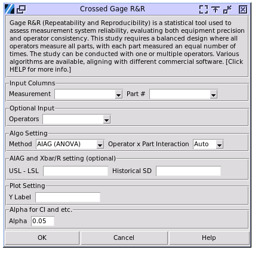

Crossed Gage R&R
================

Gage R&R (Repeatability and Reproducibility) is a statistical technique used to assess the reliability and consistency of a measurement system. It helps determine how much of the observed variation in measurements is due to the measurement system itself versus actual differences in the items being measured. Repeatability refers to the variation in measurements taken by the same person using the same instrument on the same part multiple times. Reproducibility is the variation in measurements taken by different people using the same instrument on the same part.

A crossed study is the most common type of Gage R&R study, most often used where we are able to instruct each operator to measure each part a fixed number of times. These must be continuous measurements, which means that the result is a number on a scale, as opposed to an attribute gage which gives a Go/No-Go result.

Besides crossed Gage R&R, there are nested GRR and expanded GRR. Nested GR&R is primarily used for destructive testing, where each operator measures different parts. Expanded GR&R builds upon either crossed or nested designs by incorporating additional factors beyond just operators and parts, such as different measurement equipment or environmental conditions.

Crossed Gage R&R requires that operators measure parts in a random order, ensuring the selected parts represent the actual or expected range of process variation. Every operator must evaluate every part, and for optimal results, the study should include 3 to 5 operators, though fewer than 3 may be used if that reflects the actual number of operators using the measurement system. Meanwhile, each operator must measure each part the same number of times to maintain consistency and reliability in the study.

To perform the study, choose Quality > Crossed Gage R&R

- **Measurement**: The column containing the measurement result. The values must be numerical. 
- **Part**: The column containing the part number. The values will be treated as categorical. 
- **Operators**: When the study has multiple operators, select the column with the operator indicator. The values will be treated as categorical.

