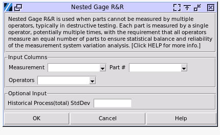

.. raw:: html

   

Nested Gage R&R
===============

Crossed and nested Gage R&R (Repeatability and Reproducibility) studies are two different approaches to assessing measurement system variation, each suited for specific testing scenarios. Choosing between crossed and nested designs depends on the nature of the measurement process and whether parts can be measured multiple times without alteration.

.. list-table:: Comparison of Crossed and Nested GR&R
   :header-rows: 1
   :widths: 20 40 40
   :class: tight-table

   * - Aspect
     - Crossed GR&R
     - Nested GR&R
   * - Testing Type
     - Non-destructive
     - Destructive
   * - Part Allocation
     - All operators measure all parts
     - Each operator measures unique parts
   * - Interaction Estimation
     - Can estimate part-operator interaction
     - Cannot estimate part-operator interaction
   * - Applicability
     - Parts can be measured multiple times
     - Parts are altered or destroyed during measurement
   * - Assumptions
     - No specific assumptions about part homogeneity
     - Assumes homogeneity within batches of parts
   * - Analysis Method
     - Average and Range or ANOVA
     - Typically requires ANOVA
   * - Part Reuse
     - Parts are reused across operators
     - Parts are not reused
   * - Flexibility
     - More flexible, allows for comprehensive analysis
     - Less flexible, but necessary for certain scenarios

To perform nested GRR choose Quality > Nested Gage R&R

- **Measurement**: Select the column containing the measurement result. The values must be numerical.
- **Part**: The column containing the part number. The values will be treated as categorical.
- **Operators**: The study requires multiple operators, select the column with the operator indicator. The values will be treated as categorical.
- **Historical Process Std Dev**: Enter a known value for the total variation, which is the part-to-part variation plus the measurement system variation. It's totally optional. By default the software will use the measured data to estimate all these values.

The result align with Minitab 22.

Using the sample data file `Nested_GRR.pickle` as an example, select the corresponding data input columns and leave the `Historical Process Std Dev` blank. The result is as below.

.. code-block:: none

   ---- Gage R&R Nested ANOVA ----
   
   Gage R&R Nested for Response
   +----------------+------+---------+-------+---------+---------+
   |     Source     |  DF  |    SS   |   MS  | F Ratio | P Value |
   +----------------+------+---------+-------+---------+---------+
   |    Operator    |  2   |  2.618  | 1.309 |  0.259  |  0.773  |
   | Part(Operator) |  27  | 136.285 | 5.048 |  34.571 |  0.000  |
   | Repeatability  |  30  |  4.380  | 0.146 |         |         |
   |     Total      |  59  | 143.283 |       |         |         |
   +----------------+------+---------+-------+---------+---------+
 
The ANOVA table helps identify significant sources of variability. It includes terms in the Source column such as "Operator," which reflects variability from operators, "Part (Operator)," representing variation from parts nested within each operator, and "Error" or "Repeatability," which captures unexplained variation, often due to random measurement error. Analyzing these terms reveals which factors significantly impact the measurement system. 

However, the key values here are the p-values. In this example, the p-value for Operator is 0.773. Because the p-value is greater than 0.05, you fail to reject the null hypothesis and can conclude that the average strength measurement probably does not depend on which operator takes the measurements. The p-value for Part (Operator) is 0.000 and is less than 0.05. The average measurements of different parts nested within each operator are significantly different.

   
.. code-block:: none

   Variance Components
   +-------------------+---------+---------------+
   | Source            | VarComp | %Contribution |
   +-------------------+---------+---------------+
   | Total Gage R&R    |  0.146  |      5.62     |
   |   Repeatability   |  0.146  |      5.62     |
   |   Reproducibility |  0.000  |      0.00     |
   | Part-to-part      |  2.451  |     94.38     |
   | Total Variation   |  2.597  |     100.00    |
   +-------------------+---------+---------------+

To assess the variation for each source of measurement error, variance components (VarComp) and %Contribution are used. The sources of variation include Total Gage R&R, Repeatability, Reproducibility, and Part-to-Part. Total Gage R&R represents the combined variance components of repeatability and reproducibility. Repeatability refers to the variability observed when the same operator measures parts from the same batch multiple times. Reproducibility, on the other hand, captures the variability when different operators measure the same parts. Part-to-Part variation accounts for the differences in measurements due to the inherent variability between different parts.

It is important to note that in cases where an operator can measure a part only once, such as in destructive testing, an assumption must be made that all parts within a single batch are identical enough to be treated as the same part. If this assumption cannot be made, the part-to-part variation within a batch may obscure the true measurement system variation. Ideally, the majority of the variability should be attributed to differences between parts (Part-to-Part), while repeatability and reproducibility should contribute minimally to the overall variation. This indicates a reliable and consistent measurement system.

The %Contribution for Total Gage R&R is 5.69% and for Part-to-Part variation is 94.31%. When the %Contribution from part-to-part variation is high, the measurement system can reliably distinguish between parts. The acceptability of a measurement system is determined by the percentage of variance components. If the variance components are less than 1%, the measurement system is considered acceptable. When the variance components fall between 1% and 9%, the system may still be acceptable, but this depends on factors such as the specific application, the cost of the measurement device, the cost of repairs, or other relevant considerations. However, if the variance components exceed 9%, the measurement system is deemed unacceptable and should be improved to ensure accurate and reliable results.
   

.. code-block:: none

   Gage Evaluation
   +-------------------+------------+--------+--------+
   | Source            | StdDev(SD) | 6 x SD |  SV%   |
   +-------------------+------------+--------+--------+
   | Total Gage R&R    |   0.382    | 2.293  | 23.71  |
   |   Repeatability   |   0.382    | 2.293  | 23.71  |
   |   Reproducibility |   0.000    | 0.000  |  0.00  |
   | Part-to-part      |   1.565    | 9.393  | 97.15  |
   | Total Variation   |   1.611    | 9.669  | 100.00 |
   +-------------------+------------+--------+--------+
   
   Number of Distinct Categories = 5

Use the percent study variation (%Study Var) to compare the measurement system variation to the total variation. The %Study Var uses the process variation, as defined by 6 times the process standard deviation. 

According to AIAG guidelines, if the measurement system variation is less than 10% of the process variation, then the measurement system is acceptable. A system with variation < 30% is conditionally acceptable. The Total Gage R&R is 23.71% of the study variation. The Total Gage R&R variation might be acceptable depending on the application. Corrective action for improving the measurement system might include training operators or acquiring better gages.

The Number of Distinct Categories (NDC) is a key metric in a Gage R&R study that evaluates a measurement system's ability to differentiate between varying levels of variability in the measured characteristic. It indicates the number of non-overlapping confidence intervals that span the range of product variation, providing insight into the system's resolution and effectiveness.

The interpretation of NDC values is as follows: If the NDC is less than 2, the measurement system lacks the capability to distinguish between parts, indicating poor resolution. An NDC between 2 and 4 suggests a limited ability to detect variability, meaning the system can differentiate parts but with significant constraints. For most applications, an NDC of 5 or greater is considered acceptable, as it demonstrates the measurement system's ability to reliably distinguish between parts and effectively capture variability.

