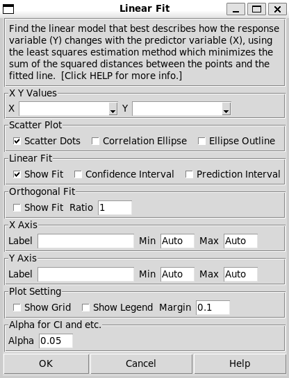
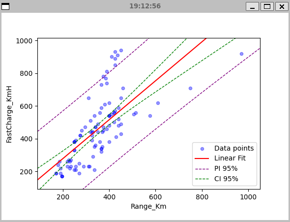
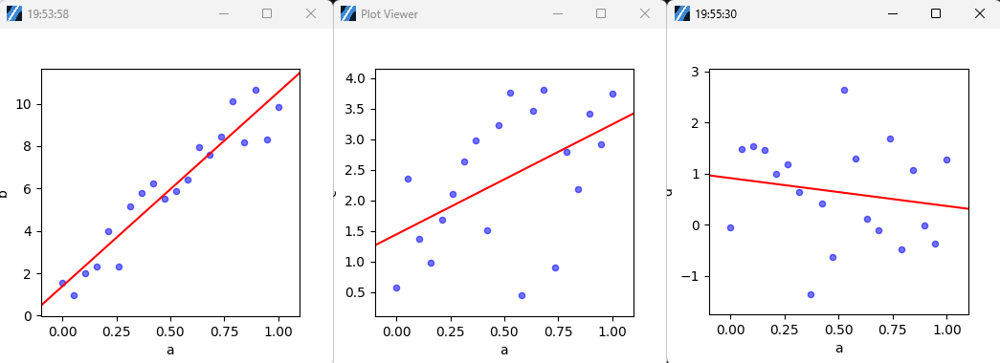

.. raw:: html

   

Linear Fit
==========

Choose Stats>Linear Fit.

The Linear fit share a same dialog with orthogonal fit, and also provide scatter plot and correlation ellipse too. 

- **X Y Values:** Select two different column for the predictor, i.e. X, and the response variable, i.e. Y. Swapping the two values does not simply Swapping the axes, but will affect the result, which will be discussed in the orthogonal fit section. 
- **Scatter Plot:** 

  - **Scatter Dots:** Turn on and off showing individual data points in the plot output.
  - **Correlation Ellipse:** Display a light blue filled ellipse for Bivariate Normal Distribution, which is only available with Pearson's correlation. The ellipse will be always drawn unless Pearson's Correlation is unselected. 
  - **Ellipse Outline:** Display a red outline of the ellipse above. Either of these two settings can work alone, but also together.

- **Linear Fit:** Show the fited line in red in the output plot.
- **Confidence Interval:** Show the confidence Interval of the fitted line in green dash. The range of the interval is decided by the Alpha settting at the end.
- **Prediction Interval:** Show the Prediction Interval of the fitted line in purple dash. The range of the interval is decided by the Alpha setting as well.

- **Orthogonal Fit:** Toggle the orthogonal fitted line, which will be discussed in next section.

- **Axis Settings:**

  - **Label:** If left blank, the axis will be labelled with the data column name.
  - **Min and Max:** The by-default min and max of axis are set by the **Margin** in **Plot Setting** below. 
  - **Legend and Grid:** They won't be shown by default.
  - **Margin:** A margin of 0.1 means using a width of 10% of range of data as the blank margin of the plot.

- **Alpha:** Set the range of Confidence Interval and Prediction Interval as (1-alpha)100%. For example, if alpha is 0.05, the CI range will be 95%, and if it's 0.2, the range will be 80%.

The output tables follows JMP pro 17 format and calibrated the result too. 

Plot Interpretation
-------------------

To understand the plot and the output prints, we will use the data in the CSV file of `ElectricCarData_Clean-kaggle.csv` in the `sample_data` folder. First using the Top Speed as the predictor variable, which is X, and the Range column as the response variable, which is Y, fit the line. Then swap their order and fit them again. 
They are good examples of swapping X and Y in linear fit generates different results. The two red lines are not symmetrical to the diagonal line. 

Fitted Line
~~~~~~~~~~~

Linear fit uses a Least Square Method. The core of calculating a linear fit lies in minimizing the distances between the actual data points and the line itself. This is done by focusing on the vertical distances (residuals) from each point to the proposed line.

It's very import to note that the distances minimized is the vertial distance to the fitted line. Since the distance is not symmetrical to the diagonal, the fitted line won't either.

Confidence Interval
~~~~~~~~~~~~~~~~~~~

The confidence interval, the green dash lines, estimates the uncertainty around the mean prediction. Or say it shows the range of 95% (or other number set by Alpha) probability the line will lay. Please note that the width of the range doesn't have correlations to the goodness of fit or linearity of the dataset. Here is an example. We use the python code below to generate data, with N equals to 30, 300 and 3000.

.. code-block:: python

        N=300 # N = 30, 300 and 3000 in the 3 tests
        x=np.random.normal(0,10,N)
        y=x+np.random.normal(0,10,N)

.. list-table::
   :widths: 33 33 33

   * - .. image:: images/linear_fit_ci30.png
     - .. image:: images/linear_fit_ci300.png
     - .. image:: images/linear_fit_ci3000.png

The distributions are identical but the number of the data varies. The confidence interval width reduces by the number of data points increases, which means the fited line position being more certain. 

In the meanwhile, the correlation ellipse shape barely changed between the plots. To visualize the correlation strength, the ellipse is the right tool. It will discussed more.

Please note that CIs assume that the model assumptions (like linearity and homoscedasticity) are met. They don't account for model misspecification or bias in data collection.

Prediction Interval
~~~~~~~~~~~~~~~~~~~

A prediction interval, the purple dash lines, estimates the range of values within which a future observation will fall, with a certain level of confidence (usually 95%, or other number set by Alpha). While confidence intervals estimate the uncertainty around the mean prediction, prediction intervals account for both the uncertainty in the estimated mean and the scatter of individual points around the regression line. Prediction intervals are always wider than confidence intervals for the same data and confidence level.

For a 95% prediction interval, we can say that there's a 95% probability that a new observation will fall within this range, given the model assumptions. The prediction interval assumes that the errors are normally distributed and that the model is correctly specified.

Summary of Fit
--------------

Back to the example above of the linear fit between top speed and range of EVs. The results below are the first part of the fit using top speed as predictor and range as the response variable.

.. highlight :: none
   
        Summary of Fit
        RSquare 0.558			RSquare Adj 0.553
        Root Mean Square Error 84.239	Mean of Response 338.786
        N = 103

- **RSquare:** R-squared ranges from 0 to 1 and represents the proportion of variance in the dependent variable that is predictable from the independent variable(s). 
  
  - In simple linear regression, the R-squared value is indeed always equal to the square of the Pearson correlation coefficient (r). However, this relationship becomes more nuanced in other scenarios. 
  - This value won't change by swapping the X and Y variables, which is same as Pearson's correlation coefficient.
  - Using the value of R-squared to indicate the goodness of fit won't have a universally agreed standard. A rough benchmark is:
    - 0.75 or higher: Generally considered a very good fit
    - 0.50 to 0.75: Moderate to good fit
    - 0.25 to 0.50: Weak to moderate fit
    - Below 0.25: Indicates a poor fit
  - Please note that judgement of the correlation with r uses different range in general. Consider the square relationship between the two values when implementing your standard.

- **R squared adjusted:** Adjusted R2 is the percentage of the variation in the response that is explained by the model, adjusted for the number of predictors in the model relative to the number of observations. Adjusted R2 is calculated as 1 minus the ratio of the mean square error (MSE) to the mean square total (MS Total).
  
- **Root Mean Square Error:** This is an important value for the fit. The Root Mean Square Error (RMSE) is calculated by taking the square root of the mean of squared differences between predicted and observed values. Linear regression specifically minimizes the sum of squared errors (which is directly related to RMSE). This is why linear regression is sometimes called "least squares regression". It tells you, on average, how far off your predictions are from the actual values.

- **Mean of Response:** The mean of response is simply the average (mean) of all your y-values (response variable) in your dataset.

.. highlight :: none
   
        Parameter Estimates
        +-----------+---------+-----------+---------+------------+
        |    Item   |   Est.  | Std Error | t Ratio | Prob > |t| |
        +-----------+---------+-----------+---------+------------+
        |   Slope   |  2.159  |   0.191   |  11.281 |   0.000    |
        | Intercept | -48.160 |   35.292  |  1.365  |   0.175    |
        +-----------+---------+-----------+---------+------------+
        p values above are the probabilities of each term == 0.

- **Parameter Estimates:** tells what is the equation of the fitted line, while `Y = Slope * X + Intercept`. In some software, the equation can be displayed on the plot, while Minijmp follows the format of JMP.

- **p-Value:** The `Prob > |t|` in the table, it is. The null hypothesis is the value, i.e. either slope or intercept, equals zero. When the p value is smaller than the significance level, the null hypothesis should be rejected and consider the sloop (or intercept) is not zero. 

.. highlight :: none
   
        Analysis of Variances
        +-------+-----+-------------+------------+
        |  Item |  DF |  Sum of Sq. |  Mean Sq.  |
        +-------+-----+-------------+------------+
        | Model |  1  |  903003.223 | 903003.223 |
        | Error | 101 |  716720.078 |  7096.238  |
        | Total | 102 | 1619723.301 |            |
        +-------+-----+-------------+------------+
        F Ratio 127.251	Prob > F 0.000
        p value is the probability of slope == 0.

- **Degrees of Freedom (DF):** The degrees of freedom of the model, which is the linear fit model, is one less than the number of terms. The linear model has slope and interpret two terms, while the degrees of freedom is one for linear fit. For more complex model the number will increase accordingly. Degrees of freedom of the errors is two less than the total number of the data points.

- **p-Value:** This is the important value to look at. If p < 0.05 (or your chosen significance level): reject the null hypothesis Conclude that your model provides a statistically significantly better fit than the intercept-only model ( which is a horizontal line at y mean) at least one of your independent variables is significantly related to the dependent variable. The p-value is used to test the hypothesis that there is no relationship between the predictor and the response. Or, stated differently, the p-value is used to test the hypothesis that the true slope coefficient is zero. 

Speaking about the slope, when increasing the random portion inside the response variable, it turns from diagonal to the horizontal direction. In plotting no matter the unit or scale differences between the predictor and response, the slope tends to be at the diagonal direction, since the axes scale fits to the data. When the two variables don't have any relationship, the slope will be zero. The direction is a great indicator for the linear relationship. That's the reason the p-value above is an important value to look at.
        
There is a good explanation of the table in Minitab website `LINK <https://support.minitab.com/en-us/minitab/help-and-how-to/statistical-modeling/regression/how-to/fit-regression-model/interpret-the-results/all-statistics-and-graphs/analysis-of-variance-table/>`_, for the rabbit-hole-digging. 

Lack of Fit
-----------

.. highlight :: none
   
        Lack of Fit
        +-------------+-----+-------------+-----------+
        |     Item    |  DF |  Sum of Sq. |  Mean Sq. |
        +-------------+-----+-------------+-----------+
        | Lack of fit |  23 |  263096.398 | 11438.974 |
        |  Pure Error |  78 |  453623.680 |  5815.688 |
        |    Total    | 102 | 1619723.301 |           |
        +-------------+-----+-------------+-----------+
        F Ratio 1.967	Prob > F 0.015	Max R Square 0.720
        p value is the probability of the true relationship is linear.

Lack of Fit (LOF) test checks if a linear model is adequate by comparing two types of variation:

- Pure Error: variation between repeated y-values at the same x (natural randomness)
- Lack of Fit: extra variation from forcing data into a linear shape

If the LOF test is significant (small p-value, `Prob > F`), it suggests a linear model isn't appropriate - meaning the true relationship might be curved or more complex. Think of it as checking: "Is my data's wiggle around the line more than just random noise would cause?"

The null hypothesis for the lack-of-fit test is that the model correctly specifies the relationship between the response and the predictors. The p-value is a probability that measures the evidence against the null hypothesis.

The quoted result above was using Top Speed as the predictor and Range as the Response, of the data in the CSV file of `ElectricCarData_Clean-kaggle.csv` in the `sample_data` folder. When swapping the predictor and response, we receive the results below (just LOF part).

.. highlight :: none
   
        Lack of Fit
        +-------------+-----+------------+----------+
        |     Item    |  DF | Sum of Sq. | Mean Sq. |
        +-------------+-----+------------+----------+
        | Lack of fit |  48 | 45627.855  | 950.580  |
        |  Pure Error |  53 | 40064.967  | 755.943  |
        |    Total    | 102 | 193658.117 |          |
        +-------------+-----+------------+----------+
        F Ratio 1.257	Prob > F 0.208	Max R Square 0.793

The p value is larger in this case and typically the null hypothesis can't be rejected. While swapping the predictor and response clearly won't change the conclusion regards the linear relationship between the two variables, it just implies among the two linear models, one is more likely to be adequate. One of the linear model not being adequate won't conclude their linear relationship.
        
To have a LOF result, you need replicate measurements (multiple y-values at same x) to perform this test, which means same X values in the dataset. When the predictor values are all unique to each other, the LOF table won't be displayed (like what JMP does).

Normality of Residuals
----------------------

In linear regression, residuals are the differences between your actual observed y-values and the predicted values from your fitted line. Think of them as how far each point "misses" the line - some points fall above the line (positive residuals) and others fall below (negative residuals).

The assumption that residuals should be normally distributed is crucial because it tells us about the nature of the "noise" or random variation in our data. When we fit a line to data, we're essentially saying "this line represents the true relationship, plus some random error." If these errors (residuals) follow a normal distribution, it suggests that the scatter around our line is natural random variation, rather than being caused by some systematic pattern we're missing. This normal distribution of residuals is what we'd expect if many small, independent factors are affecting our measurements.

When residuals aren't normally distributed, it often signals a problem with our linear model. It might mean we're missing an important curved relationship, we've left out key variables, or our data contains outliers that are pulling the line in strange ways. This is why checking residual normality is a standard diagnostic tool - it helps validate whether our linear regression assumptions are reasonable. Both Minitab and JMP provide tests and plots to check this assumption, helping users determine if their linear model is appropriate for their data.

.. highlight :: none
   
        Normality of Residuals
        Shapiro-Wilk Statistics 0.968	p-value 0.015
        Anderson Darling Stats. 1.174	p-value 0.004
        p values are the probabilities of true dist is normal.

P value in the results indicates the probability of the residuals coming from a normal distribution. When the p-value is higher than the significance level the residuals are likely to have a normal distribution. When the p-value is smaller than the significance level, the null hypothesis should be rejected, while there is likely to be portions more than random errors in the residuals. 

To learn more about the normality test, please check the help page of `Normality` Dialog. `LINK <https://minijmp.readthedocs.io/en/latest/usage/normality.html>`_

The software provides more tools to visualize the linear fit residuals. Please check the next section `Residual Plot`. `LINK <https://minijmp.readthedocs.io/en/latest/usage/residuals.html>`_

