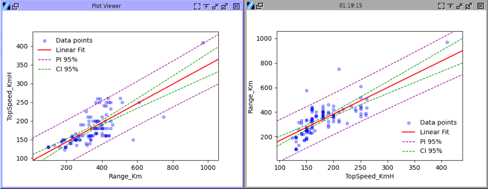

.. raw:: html

   

Linear Regression
==========

Choose Stats > Linear Regression.

The Linear regression share a same dialog with orthogonal regression, and also provide scatter plot and correlation ellipse too. 

- **X Y Values:** Select two different columns for the predictor (X) and the response variable (Y). Swapping these values does not simply swap the axes but will affect the result, which will be discussed in the orthogonal regression section. 
- **Scatter Plot:** 

  - **Scatter Dots:** Toggle the display of individual data points in the plot output.
  - **Correlation Ellipse:** Display a light blue filled ellipse for Bivariate Normal Distribution, which is only available with Pearson's correlation.   
  - **Ellipse Outline:** Display a red outline of the ellipse above. Either of these two settings can work alone, but also together.

- **Linear Regression:** Show the fited line in red in the output plot.
- **Confidence Interval:** Show the confidence interval of the fitted line in green dashes. The range of the interval is determined by the Alpha setting at the end.
- **Prediction Interval:** Show the prediction interval of the fitted line in purple dashes. The range of the interval is also determined by the Alpha setting.

- **Orthogonal Regression:** Toggle the orthogonal regressionted line, which will be discussed in next section.

- **Axis Settings:**

  - **Label:** If left blank, the axis will be labeled with the data column name.
  - **Min and Max:** The default min and max of the axis are set by the **Margin** in **Plot Setting** below.
  - **Legend and Grid:** They won't be shown by default.
  - **Margin:** A margin of 0.1 means using a width of 10% of the data range as the blank margin of the plot.

- **Alpha:** Set the range of the Confidence Interval and Prediction Interval as (1-alpha)100%. For example, if alpha is 0.05, the CI range will be 95%, and if it's 0.2, the range will be 80%.

The output tables follow the JMP Pro 17 format and calibrate the results accordingly.

Plot Interpretation
-------------------

To understand the plot and the output prints, we will use the data in the CSV file `ElectricCarData_Clean-kaggle.csv` in the `sample_data` folder. First, use the Top Speed as the predictor variable (X) and the Range column as the response variable (Y) to fit the line. Then swap their order and fit them again. They are good examples of how swapping X and Y in linear regression generates different results. The two red lines are not symmetrical to the diagonal line.

Fitted Line
~~~~~~~~~~~

Linear regression uses the Least Squares Method. The core of calculating a linear regression lies in minimizing the distances between the actual data points and the line itself. This is done by focusing on the vertical distances (residuals) from each point to the proposed line.

It's very important to note that the distances minimized are the vertical distances to the fitted line. Since the distance is not symmetrical to the diagonal, the fitted line won't be either.

Confidence Interval
~~~~~~~~~~~~~~~~~~~

The confidence interval, shown as green dashed lines, estimates the uncertainty around the mean prediction. It shows the range of 95% (or another number set by Alpha) probability where the line will lie. Please note that the width of the range doesn't correlate with the goodness of fit or linearity of the dataset. Here is an example. We use the Python code below to generate data, with N equal to 30, 300, and 3000.

.. code-block:: python

        N=300 # N = 30, 300 and 3000 in the 3 tests
        x=np.random.normal(0,10,N)
        y=x+np.random.normal(0,10,N)

.. list-table::
   :widths: 33 33 33

   * - .. image:: images/linear_fit_ci30.png
     - .. image:: images/linear_fit_ci300.png
     - .. image:: images/linear_fit_ci3000.png

The distributions are identical, but the number of data points varies. The confidence interval width reduces as the number of data points increases, indicating the fitted line position is more certain.

Meanwhile, the correlation ellipse shape barely changes between the plots. To visualize the correlation strength, the ellipse is the right tool. It will be discussed more.

Please note that CIs assume that the model assumptions (like linearity and homoscedasticity) are met. They don't account for model misspecification or bias in data collection.

Prediction Interval
~~~~~~~~~~~~~~~~~~~

A prediction interval, shown as purple dashed lines, estimates the range of values within which a future observation will fall, with a certain level of confidence (usually 95%, or another number set by Alpha). While confidence intervals estimate the uncertainty around the mean prediction, prediction intervals account for both the uncertainty in the estimated mean and the scatter of individual points around the regression line. Prediction intervals are always wider than confidence intervals for the same data and confidence level.

For a 95% prediction interval, we can say that there's a 95% probability that a new observation will fall within this range, given the model assumptions. The prediction interval assumes that the errors are normally distributed and that the model is correctly specified.

Summary of Fit
--------------

Returning to the example above of the linear regression between top speed and range of EVs, the results below are the first part of the fit using top speed as the predictor and range as the response variable.

.. code-block:: none

        Summary of Fit
        RSquare 0.558			RSquare Adj 0.553
        Root Mean Square Error 84.239	Mean of Response 338.786
        N = 103

- **RSquare:** R-squared ranges from 0 to 1 and represents the proportion of variance in the dependent variable that is predictable from the independent variable(s). 
  
  - In simple linear regression, the R-squared value is indeed always equal to the square of the Pearson correlation coefficient (r). However, this relationship becomes more nuanced in other scenarios.
  - This value won't change by swapping the X and Y variables, which is the same as Pearson's correlation coefficient.
  - Using the value of R-squared to indicate the goodness of fit doesn't have a universally agreed standard. A rough benchmark is:
 
    - 0.75 or higher: Generally considered a very good fit
    - 0.50 to 0.75: Moderate to good fit
    - 0.25 to 0.50: Weak to moderate fit
    - Below 0.25: Indicates a poor fit
 
  - Please note that the judgment of the correlation with r uses a different range in general. Consider the square relationship between the two values when implementing your standard.

- **R squared adjusted:** Adjusted R² is the percentage of the variation in the response that is explained by the model, adjusted for the number of predictors in the model relative to the number of observations. Adjusted R² is calculated as 1 minus the ratio of the mean square error (MSE) to the mean square total (MS Total).
  
- **Root Mean Square Error:** This is an important value for the fit. The Root Mean Square Error (RMSE) is calculated by taking the square root of the mean of squared differences between predicted and observed values. Linear regression specifically minimizes the sum of squared errors (which is directly related to RMSE). This is why linear regression is sometimes called "least squares regression". It tells you, on average, how far off your predictions are from the actual values.

- **Mean of Response:** The mean of response is simply the average (mean) of all your y-values (response variable) in your dataset.

.. code-block:: none
   
        Parameter Estimates
        +-----------+---------+-----------+---------+------------+
        |    Item   |   Est.  | Std Error | t Ratio | Prob > |t| |
        +-----------+---------+-----------+---------+------------+
        |   Slope   |  2.159  |   0.191   |  11.281 |   0.000    |
        | Intercept | -48.160 |   35.292  |  1.365  |   0.175    |
        +-----------+---------+-----------+---------+------------+
        p values above are the probabilities of each term == 0.

- **Parameter Estimates:** This tells what the equation of the fitted line is, while `Y = Slope * X + Intercept`. In some software, the equation can be displayed on the plot, while Minijmp follows the format of JMP.

- **p-Value:** The `Prob > |t|` in the table is the p-value. The null hypothesis is that the value, i.e., either slope or intercept, equals zero. When the p-value is smaller than the significance level, the null hypothesis should be rejected, and consider the slope (or intercept) is not zero.

.. code-block:: none
   
        Analysis of Variances
        +-------+-----+-------------+------------+
        |  Item |  DF |  Sum of Sq. |  Mean Sq.  |
        +-------+-----+-------------+------------+
        | Model |  1  |  903003.223 | 903003.223 |
        | Error | 101 |  716720.078 |  7096.238  |
        | Total | 102 | 1619723.301 |            |
        +-------+-----+-------------+------------+
        F Ratio 127.251	Prob > F 0.000
        p value is the probability of slope == 0.

- **Degrees of Freedom (DF):** The degrees of freedom of the model, which is the linear regression model, is one less than the number of terms. The linear model has slope and intercept as two terms, while the degrees of freedom is one for linear regression. For more complex models, the number will increase accordingly. Degrees of freedom of the errors is two less than the total number of the data points.

- **p-Value:** This is a crucial metric in determining the statistical significance of your model. If the p-value is less than 0.05 (or your chosen significance level), you should reject the null hypothesis. This indicates that your model provides a statistically significant improvement over the intercept-only model (a horizontal line at the mean of y). In other words, at least one of your independent variables is significantly related to the dependent variable. The p-value tests the hypothesis that there is no relationship between the predictor and the response, or equivalently, that the true slope coefficient is zero.

.. image:: images/linear_fit_slope.png
   :align: center

Regarding the slope, as the random variation in the response variable increases, the slope may shift from a diagonal to a horizontal orientation. Regardless of the unit or scale differences between the predictor and response, the slope typically aligns diagonally because the axes are scaled to fit the data. When there is no relationship between the two variables, the slope will be zero. The slope's direction is a strong indicator of a linear relationship, which is why the p-value mentioned earlier is crucial to consider.
       

There is a good explanation of the table in Minitab website `LINK <https://support.minitab.com/en-us/minitab/help-and-how-to/statistical-modeling/regression/how-to/fit-regression-model/interpret-the-results/all-statistics-and-graphs/analysis-of-variance-table/>`_, for the rabbit-hole-digging. 

Lack of Fit
-----------

.. code-block:: none
   
        Lack of Fit
        +-------------+-----+-------------+-----------+
        |     Item    |  DF |  Sum of Sq. |  Mean Sq. |
        +-------------+-----+-------------+-----------+
        | Lack of fit |  23 |  263096.398 | 11438.974 |
        |  Pure Error |  78 |  453623.680 |  5815.688 |
        |    Total    | 102 | 1619723.301 |           |
        +-------------+-----+-------------+-----------+
        F Ratio 1.967	Prob > F 0.015	Max R Square 0.720
        p value is the probability of the true relationship is linear.

Lack of Fit (LOF) test checks if a linear model is adequate by comparing two types of variation:

- Pure Error: This represents the variation between repeated y-values at the same x-value, reflecting natural randomness.
- Lack of Fit: This indicates additional variation that arises when data is forced into a linear shape.

If the LOF test is significant (i.e., it has a small p-value, Prob > F), it suggests that a linear model may not be appropriate, implying that the true relationship could be curved or more complex. Essentially, it checks whether the data's deviation from the line is more than what random noise would cause.

The null hypothesis for the lack-of-fit test is that the model correctly specifies the relationship between the response and the predictors. The p-value measures the evidence against this null hypothesis.

The quoted result above was using Top Speed as the predictor and Range as the Response, of the data in the CSV file of `ElectricCarData_Clean-kaggle.csv` in the `sample_data` folder. When swapping the predictor and response, the results below were observed (only the LOF part is shown):

.. code-block:: none
   
        Lack of Fit
        +-------------+-----+------------+----------+
        |     Item    |  DF | Sum of Sq. | Mean Sq. |
        +-------------+-----+------------+----------+
        | Lack of fit |  48 | 45627.855  | 950.580  |
        |  Pure Error |  53 | 40064.967  | 755.943  |
        |    Total    | 102 | 193658.117 |          |
        +-------------+-----+------------+----------+
        F Ratio 1.257	Prob > F 0.208	Max R Square 0.793

In this case, the larger p-value typically means the null hypothesis cannot be rejected. While swapping the predictor and response does not change the conclusion about the linear relationship between the two variables, it suggests that one of the linear models is more likely to be adequate. The inadequacy of one linear model does not negate their linear relationship.
        
To obtain a LOF result, replicate measurements (multiple y-values at the same x) are necessary, meaning the dataset must contain identical X values. When all predictor values are unique, the LOF table will not be displayed, similar to the behavior in JMP.

Normality of Residuals
----------------------

In linear regression, residuals are the differences between the actual observed y-values and the predicted values from the fitted line. They represent how far each data point deviates from the line—some points fall above the line (positive residuals) and others fall below (negative residuals).

The assumption that residuals should be normally distributed is crucial because it informs us about the nature of the "noise" or random variation in the data. When fitting a line to data, the line is considered to represent the true relationship, plus some random error. If these errors (residuals) follow a normal distribution, it suggests that the scatter around the line is due to natural random variation, rather than a systematic pattern that might have been overlooked. This normal distribution of residuals is expected if many small, independent factors are affecting the measurements.

When residuals aren't normally distributed, it often indicates a problem with the linear model. It might suggest a missing important curved relationship, omitted key variables, or the presence of outliers that are influencing the line in unexpected ways. This is why checking residual normality is a standard diagnostic tool—it helps validate whether the linear regression assumptions are reasonable. Both Minitab and JMP provide tests and plots to check this assumption, assisting users in determining if their linear model is appropriate for their data.

.. code-block:: none
   
        Normality of Residuals
        Shapiro-Wilk Statistics 0.968	p-value 0.015
        Anderson Darling Stats. 1.174	p-value 0.004
        p values are the probabilities of true dist is normal.

The p-value in the results indicates the probability of the residuals coming from a normal distribution. When the p-value is higher than the significance level, the residuals are likely to have a normal distribution. Conversely, when the p-value is smaller than the significance level, the null hypothesis should be rejected, suggesting that there may be more than random errors in the residuals.

To learn more about the normality test, please check the help page of `Normality` Dialog. `LINK <https://minijmp.readthedocs.io/en/latest/usage/normality.html>`_

The software provides more tools to visualize the linear regression residuals. Please check the next section `Residual Plot`. `LINK <https://minijmp.readthedocs.io/en/latest/usage/residuals.html>`_

