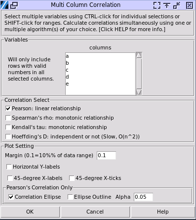
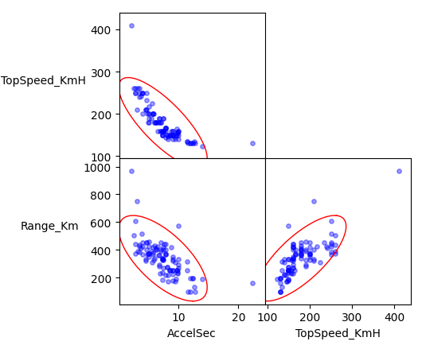

Multiple-variable Correlation
=============================

Choose Stats>Correlation Matrix

- **Variables:** Select multiple variables with your mouse, using SHIFT-Click to select a range, and CTRL-Click to toggle a single selection. The columns selected must have continuous data. Categorical data will be ignored, while only the rows, which containing numerical cells in all the selected columns, will be used.

- **Correlation Select:**  There are two main types of correlation analyses: parametric (like Pearson's correlation) and nonparametric (such as Spearman's and Kendall's correlations). Their difference will be discussed, however select Pearson's Correlation by default if you are not sure. Multiple correlation algorithms can be selected at the same time.

- **Plot Setting:** A group of scatter plots of data will be displayed, all the settings below are about this plot. 

  - **Margin:** A margin of 0.1 means using a width of 10% of range of data as the blank margin of each plot.
  - **Horizontal Y-Labels:** Change the label of each variable on Y axis to horizontal direction. The default direction is vertical. 
  - **45-degree X Labels and Ticks:** Change the label of each variable on X axis or value ticks to 45 degree direction. The default direction is horizontal.
  - **Pearson's Correlation Options:**

    - **Correlation Ellipse:** Display a light blue filled ellipse for Bivariate Normal Distribution, which is only available with Pearson's correlation. The ellipse will be always drawn unless Pearson's Correlation is unselected. 
    - **Ellipse Outline:** Display a red outline of the ellipse above. Either of these two settings can work alone, but also together.
    - **Alpha:** It determines the contour level of the ellipse. If alpha is 0.05, the ellipse of 95% Probability Contour will be displayed; while 0.3 for 70% of Probability Contour. Leave it by default if you are not sure. This alpha also determines the confidence intervals range of the Pearson's correlation coefficient.

A sample output. 

.. code-block:: none

   ---- Hoeffding's D correlation coefficient ----
   +--------------+----------+--------------+----------+
   |      \       | AccelSec | TopSpeed_KmH | Range_Km |
   +--------------+----------+--------------+----------+
   |   AccelSec   |  0.948   |    0.451     |  0.209   |
   | TopSpeed_KmH |  0.451   |    0.807     |  0.233   |
   |   Range_Km   |  0.209   |    0.233     |  0.951   |
   +--------------+----------+--------------+----------+
   
   ---- Hoeffding's D correlation p-value  ----
   +--------------+----------+--------------+----------+
   |      \       | AccelSec | TopSpeed_KmH | Range_Km |
   +--------------+----------+--------------+----------+
   |   AccelSec   |  0.000   |    0.000     |  0.000   |
   | TopSpeed_KmH |  0.000   |    0.000     |  0.000   |
   |   Range_Km   |  0.000   |    0.000     |  0.000   |
   +--------------+----------+--------------+----------+
   
   ---- Pearson correlation coefficient ----
   +--------------+----------+--------------+----------+
   |      \       | AccelSec | TopSpeed_KmH | Range_Km |
   +--------------+----------+--------------+----------+
   |   AccelSec   |  1.000   |    -0.786    |  -0.677  |
   | TopSpeed_KmH |  -0.786  |    1.000     |  0.747   |
   |   Range_Km   |  -0.677  |    0.747     |  1.000   |
   +--------------+----------+--------------+----------+
   
   ---- Pearson correlation p-value  ----
   +--------------+----------+--------------+----------+
   |      \       | AccelSec | TopSpeed_KmH | Range_Km |
   +--------------+----------+--------------+----------+
   |   AccelSec   |  0.000   |    0.000     |  0.000   |
   | TopSpeed_KmH |  0.000   |    0.000     |  0.000   |
   |   Range_Km   |  0.000   |    0.000     |  0.000   |
   +--------------+----------+--------------+----------+
  
To interpret the results please check out the help page of `Correlation`. `LINK <https://minijmp.readthedocs.io/en/latest/usage/cor.html>`_

