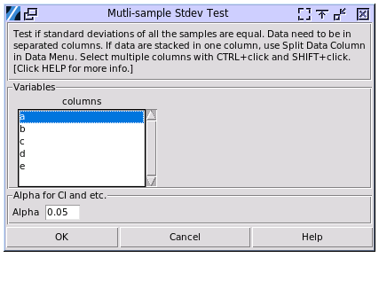

.. raw:: html

   

Multi-Sample StDev Test
=======================

Choose Stats> Multi Sample Stdev Test

- **Variables:** Select multiple variables with your mouse, using SHIFT-Click to select a range, and CTRL-Click to toggle a single selection. The columns selected must have continuous data. Categorical data will be ignored. The columns do not have to have same count of observations.
- **Alpha:** Set the confidence interval range to be calculated as (1-alpha)100%. For example, when alpha is set to 0.05, a 95% confidence interval will be displayed.

Use the test for equal variances to determine whether the variances or the standard deviations of two or more groups differ. For example, a lumber distributor wants to compare the variation of beam lengths that are cut by three sawmills. If any sawmill produces beams that have significantly more variation, the distributor may stop selling lumber from that sawmill.

The results were calibrated with JMP 17, but the p-values may differ from those in Minitab 20.

A sample output:

.. code-block:: none

  ---- Multi Sample Standard Deviation Test ----
  +--------+----+-------+------------------+-------------+---------------+
  | Sample | N  | stdev | 95.00% CI of std | MAD to Mean | MAD to Median |
  +--------+----+-------+------------------+-------------+---------------+
  |   a    | 20 | 1.014 |  (0.771, 1.480)  |    0.813    |     0.803     |
  |   b    | 20 | 1.061 |  (0.807, 1.550)  |    0.857    |     0.838     |
  +--------+----+-------+------------------+-------------+---------------+
  Note: MAD to Mean is Mean Absolute Difference to Mean. MAD to Median is 
  Mean Absolute Difference to Median.
  
  H0: All variances are equal. H1: At least one variance is different.
  
  O'Brien[.5]       p = 0.848
  Levene            p = 0.813
  Brown-Forsythe    p = 0.866
  2 Sided F test    p = 0.845
  
  Note: the results were calibrated with JMP17.

The Mean Absolute Deviation (MAD) to Mean is calculated as :math:`\text{MAD} = \frac{1}{n} \sum_{i=1}^n |x_i - \mu|`, where :math:`x_i` are individual values, :math:`\mu` is the mean, and :math:`n` is the number of observations.

  - :math:`|x_i - \mu|` calculates the absolute difference between each value and the mean.
  - The sum :math:`\sum_{i=1}^n |x_i - \mu|` adds up all these absolute differences.
  - Dividing by :math:`n` gives the average of these differences.
  - A larger MAD indicates greater variability in the data, while a smaller MAD suggests data points are closer to the mean.

The MAD to Median is similar, but uses the median instead of the mean. When the dataset has high skewness, use the value with the median instead of the mean.

The test for equal variances is a hypothesis test that evaluates two mutually exclusive statements about two or more population standard deviations. These statements are the null hypothesis and the alternative hypothesis. A hypothesis test uses sample data to determine whether to reject the null hypothesis. The hypotheses for a test for equal variances are as follows:

- **Null hypothesis (H0):** The population standard deviations are all equal.
- **Alternative hypothesis (H1):** Not all population standard deviations are equal.

Compare the p-value to the significance level to determine whether to reject the null hypothesis.

There are several algorithms used in the evaluation. `2 Sided F Test` will only be used when there are two samples. 

O'Brien's test is a robust method for testing homogeneity of variances:

1. It transforms the original data using a weighted average of the squared deviation from the group mean and the group variance.
2. The test statistic is then calculated using either a one-way ANOVA F-test on the transformed data.
3. O'Brien's test with r=0.5 is recommended for general use due to its balance between robustness and power.

Levene's test is widely used for assessing equality of variances:

1. It calculates the absolute deviations from the group means.
2. Performs a one-way ANOVA on these deviations.
3. The test is robust against departures from normality.

The Brown-Forsythe test is a modification of Levene's test:

1. It uses deviations from the group medians instead of means.
2. Performs a one-way ANOVA on these deviations.
3. This test is more robust against non-normal distributions compared to Levene's test.

The two-sided F-test is used to compare the variances of two populations:

1. It calculates the ratio of the two sample variances.
2. The test statistic follows an F-distribution under the null hypothesis.
3. It is sensitive to departures from normality.

.. list-table:: Comparison of the methods
   :header-rows: 1
   :widths: 20 20 20 20 20
   :class: tight-table

   * - Criterion
     - O'Brien's Test
     - Levene's Test
     - Brown-Forsythe Test
     - Two-sided F-test
   * - Robustness
     - Very robust
     - Robust
     - Most robust
     - Least robust
   * - Number of groups
     - Multiple
     - Multiple
     - Multiple
     - Two only
   * - Power
     - Good balance
     - Moderate
     - Moderate
     - Highest (if normal)
   * - Sensitivity to outliers
     - Moderate
     - Moderate
     - Least affected
     - Most affected

In practice, the choice between these tests often depends on the specific characteristics of the data and the research context. For general use, especially when normality cannot be assumed, the Brown-Forsythe or O'Brien's test are often recommended due to their robustness and power across various scenarios.
