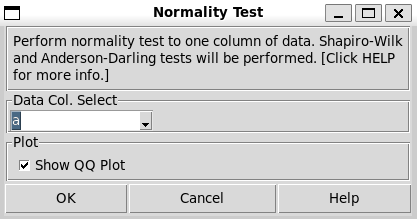

.. raw:: html

   

Normality
---------

Choose Stats>Normality. 

A normality test is a statistical procedure used to determine whether a dataset follows a normal distribution. This is important because many statistical methods assume normality in the data, and violations of this assumption can lead to incorrect conclusions. There are several normality tests available, each with its own methodology and application scenarios.

- **Shapiro-Wilk Test:** The Shapiro-Wilk test is one of the most powerful normality tests, particularly effective for small to moderate sample sizes. It calculates a W statistic that measures how closely the sample data matches a normal distribution. A small W value indicates significant deviation from normality, leading to the rejection of the null hypothesis that the data is normally distributed.

- **The Anderson-Darling test:** is another robust normality test that builds on the Kolmogorov-Smirnov test by giving more weight to the tails of the distribution. This makes it particularly sensitive to deviations in the tails of the data distribution. It calculates an A² statistic, with larger values indicating greater deviation from normality.

.. list-table:: Differences Between Shapiro-Wilk and Anderson-Darling Tests
   :widths: 20 40 40
   :header-rows: 1
   :class: tight-table

   * - Aspect
     - Shapiro-Wilk Test
     - Anderson-Darling Test
   * - Sensitivity
     - Effective for small to moderate sample sizes
     - Sensitive to deviations in the tails of the distribution
   * - Statistic Used
     - W statistic
     - A² statistic
   * - Power
     - Generally exhibits higher statistical power overall
     - Also powerful but slightly less so than Shapiro-Wilk
   * - Weighting
     - Does not specifically emphasize tails
     - Places more weight on the tails of the distribution
   * - Use Case
     - Preferred for general use with smaller datasets
     - Useful when tail behavior is critical

A sample output.

QQ plots compare the quantiles of the sample data against the quantiles of a theoretical normal distribution. This allows for a visual inspection of how closely the data follows normality. 

- Normally Distributed Data: If the data is normally distributed, the points on the QQ plot will roughly form a straight line from the lower left to the upper right corner.
- Non-Normal Data: Deviations from this straight line indicate departures from normality.

