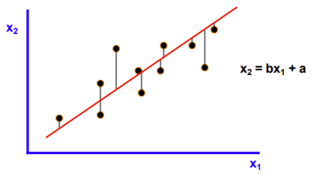

.. raw:: html

   

Orthogonal Regression
=====================

The Orthogonal Regression, also known as Deming regression, is to determine whether two instruments or methods provide comparable measurements. Orthogonal regression examines the linear relationship between two continuous variables: one response (Y) and one predictor (X). 

- Unlike simple linear regression (least squares regression), both the response and predictor in orthogonal regression contain measurement error. 
- In Linear Regression, i.e. simple regression, only the response variable contains measurement error, or saying the calculation considers that the predictor doesn't have measurement error.

Choose Stats>Orthogonal Regression.

PUT DIALOG IMAGE HERE

- **X Y Values:** Select two different columns for the predictor, i.e. X, and the response variable, i.e. Y. 
- **Orthogonal Regression**

  - **Show Fit:** The orthogonal regression shares the dialog with linear regression. By default, keep the box checked, otherwise orthogonal regression will not be performed. 
  - **Residal Table:** Show the residuals, standardized residuals, eastimated x and y values in a table printed out. 
  - **Error variance ratio (Y/X):** The ratio the error variance uses the measurement error not the variance of the input data. One approach to get the variance of the measurement is GRR. Leave it 1 by default for equal variance assumption, if the ratio is unavailable. 
  - **Alpha:** Set the range of confidence intervals to be calculated, (1-alpha)100%. When alpha is set to 0.05, 95% confidence interval will be displayed.
    
This tool is calibrated to Minitab 20. JMP uses different output format, and some numbers, such as CI, with slight differences.

OLS and Orthogonal Regression
-----------------------------

Linear regression in previous sections is also called as ordinary least squared (OLS) regression. The method minimizes the squared sum of the vertial distances between the observed responses and the fitted line. The method only considering the measurement error of the response variable, and treating the predictor accurate without measurement errors. This is usually not the case, which both variables have measurement errors. Linear Regression thus is a good tool to make predicting models but not for showing data relationship. 

Orthogonal Regression considers both variables carrying measurement errors, which matches common circumstances. The method minimizes the orthogonal distances from the observed points to the fitted line, when the error variance ratio is 1. The method shows better the relationship between the two variables, though due to its complexity, linear regression is more suitable for value predicting. 

For example, a dataset has X and Y values both generated by `np.linspace(0, 10, 500) + np.random.normal(0, 1, 500)`. The real relationship between the two sets should be a straight line with slope euqaling to one. After applied both regression methods to the dataset, the linear regression, the red line, has smaller slope than one, since it considering all the errors in to response variable. The orthogonal regression gives the line close to the position. 

.. image:: images/ortho_cmp.png
   :align: center

Here below is a comparison table between the two methods.

.. list-table:: Comparison of OLS Regression and Orthogonal Regression
   :header-rows: 1
   :widths: 20 40 40
   :class: tight-table

   * - Aspect
     - OLS Regression
     - Orthogonal Regression
   * - Principle
     - Minimizes sum of squared vertical distances
     - Minimizes sum of squared perpendicular distances
   * - Key Assumptions
     - - X measured without error
       - All error in Y
       - Errors normally distributed with constant variance
     - - Both X and Y can have measurement errors
       - Error variance ratio known or estimable
   * - Variable Treatment
     - Asymmetric (X error-free)
     - Symmetric (both X and Y have errors)
   * - Prediction Focus
     - Optimized for predicting Y given X
     - Describes true relationship between X and Y
   * - Computation
     - Relatively simple and widely implemented
     - Generally more complex
   * - Strengths
     - - Suitable when X is controlled/precise
       - Unbiased estimates when assumptions met
       - Widely understood and used
     - - Appropriate with errors in both variables
       - Better for true relationship description
       - Invariant to coordinate rotation
   * - Limitations
     - - Biased with significant X error
       - Not suitable for symmetrical relationships
     - - More sensitive to outliers
       - Requires known/estimated error variance ratio
       - Less widely implemented
   * - Outlier Sensitivity
     - Less sensitive
     - More sensitive
   * - Rotation Invariance
     - No
     - Yes
   * - Typical Applications
     - Predictive modeling
     - Describing true relationships, method comparisons

Error Variance Ratio
--------------------

The error variance ratio is a crucial concept in orthogonal regression, also known as total least squares or errors-in-variables regression. This ratio plays a significant role in determining the fit of the regression line and has important implications for the interpretation of the results. Let's explore this concept in detail 

The error variance ratio in orthogonal regression refers to the ratio of the variance of errors in the y-variable to the variance of errors in the x-variable. Mathematically the error variance ratio λ is defined as:

.. math::

   \lambda = \frac{\sigma_x^2}{\sigma_y^2}

Where :math:`\sigma_x^2` is the variance of errors in x, and :math:`\sigma_y^2` is the variance of errors in y.

His ratio is crucial because it determines how the orthogonal regression line is fitted to the data. Unlike ordinary least squares (OLS) regression, which assumes all error is in the y-variable, orthogonal regression acknowledges that both x and y can have measurement errors. The error variance ratio quantifies the relative uncertainty in these measurements.

The error variance ratio affects the slope and intercept of the orthogonal regression line:

- When λ = 1 (equal error variances), the orthogonal regression line bisects the angle between the vertical and horizontal OLS regression lines.
- When λ > 1 (more error in y), the line tilts closer to the OLS regression of y on x.
- When λ < 1 (more error in x), the line tilts closer to the OLS regression of x on y.

This behavior reflects the method's attempt to balance the errors in both variables according to their relative magnitudes. The plots below show the previous sample of fitting with orthogonal regression and linear regression with the ratio is 1 (LEFT), and the ratio is 10 (RIGHT). When the Y to X ratio becomes larger, implies that the measurement error in Y is more significant, the fitted line moves close to the linear regression result.

In practice, the true error variance ratio is often unknown and must be estimated or assumed:

- If the measurement precisions of x and y are known, the ratio can be directly calculated.
- In many cases, researchers assume λ = 1.
- If comparing data from two measurement results, using the Gauge Repeatability and Reproducibility (GRR) variance as the measurement variance for orthogonal fit input is indeed a valid and often recommended approach. This method provides a robust estimate of measurement uncertainty that can significantly improve the accuracy of your orthogonal fit model.

When the ratio is one, the orthogonal regression is minimizing the orthogonal distances between the data points and fitted line. However, when the ratio is not equal to one, the distances direction starts to move away from the orthogonal direction, until becoming vertical or horizontal when the ratio goes very large or small.

Fit Summary
-----------

.. code-block:: none

   ---- Orthogonal Regression alpha = 0.050 ----
   Slope 1.004 CI(0.960, 1.049)
   Intercept 0.046 CI(-0.249, 0.340)
   
   Error Variance Ratio 1.000
   X error variance 0.998
   Y error variance 0.998
   
   Normality of Residuals
   
   ---- Normality Test ----
   Shapiro-Wilk test       stats 0.997     p-value 0.600
   Anderson Darling test   stats 0.349     p-value 0.474
   P-value indicates the probability of sampling from a 
   normal distributed population.

Parameter estimates of slope and intercept tell what is the equation of the fitted line, while `Y = Slope * X + Intercept`. The confidence interval estimates the uncertainty around the mean prediction. Or say it shows the range of 95% (or other number set by Alpha) probability the line will lay. 

Error Variances in X and Y are the numbers of from evaluation, they are not necessary to be equal to the GRR variances for the two variables. But it's a good way to summarize those from the current dataset. The quoted result was for the dataset generated by `np.linspace(0, 10, 500) + np.random.normal(0, 1, 500)`. The random portion in both X and Y has variance set to 1. The variance from the orthogonal regression gives a close result.

