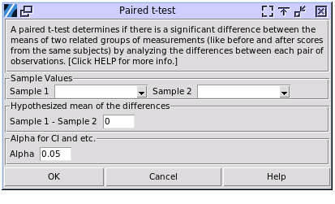

Paired t-test
=============

Choose Stats> Paired t-test

- **Sample Values:** The columns that contain the sampled values. The values have to be numerical and continuous. For this test, the order of the two matters. The values of one pair should be in the same row. Any row that does not contain two valid values will be ingored. 
- **Hypothesized mean of the differences:"** The hypothesized the value of mean of the differences of each paired values, sample 1 - sample 2. For example if want to test whether there is change in samples before and after a process, set the value to zero, which means the null hypothesis is no change between the two stages.
- **Alpha:** The significance level used in the calculation. For example the confidence intervals, the range of confidence intervals is (1-alpha)100%.

The results were aligned with JMP 17 and Minitab 20.

A sample output:

.. code-block:: none

  ---- Paired t test ----
  Hypothesized population mean of the differences u0 = 0.000
  Paired difference (Sample 1 - Sample 2):
  mean (ud) = 0.222
  stdev = 1.671
  t = 0.596
  df = 19.000
  n = 20
  H0: ud == u0, H1: ud != u0, p = 0.558
  95.00% range of the difference's mean: (-0.559, 1.004)
  H0: u == u0, H1: ud > u0, p value = 0.279
  95.00% Lower bound of difference's mean: -0.423
  H0: u == u0, H1: ud < u0, p value = 0.721
  95.00% Upper bound of difference's mean: 0.868

Behind the scene, a paired t-test will first calculate the difference of each pair, and then use the differences as a set of data to do one sample t-test with the hypothesized difference mean. The output mean and standard deviation are the statistics of the differences. If not sure, it's recommended to refer to the first set of null hypothesis whose alternative hypothesis is the difference mean is not equal to the hypothesized difference mean. In the example above, the p-value is 0.558, the null hypothesis can't be rejected, which means there is no significant difference between the two stages.

