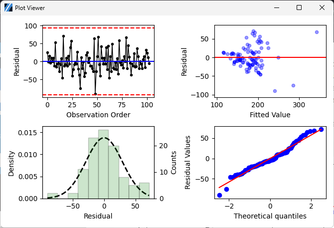

Residual Plots
==============

Choose Stats>Residual Plots

.. image:: images/residual1.png
   :align: center

- **X Y Values:** Select two different column for the predictor, i.e. X, and the response variable, i.e. Y. Only residual plots will be displayed, linear regression of the two variable is done at the backend and won't be shown. 

.. include:: linear_fit.rst
   :start-line: 207
   :end-line: 225

- **Residuals versus order:** The residuals versus order plot displays the residuals in the order that the data were collected.

  - Use the residuals versus order plot to verify the assumption that the residuals are independent from one another. 
  - Independent residuals show no trends or patterns when displayed in time order. Ideally, the residuals on the plot should fall randomly and not exceed the red dash lines.
  - Patterns in the points may indicate that residuals near each other may be correlated, and thus, not independent. 

.. list-table::
   :widths: 33 33 33

   * - .. image:: images/residuals_vs_order_cycles.png
     - .. image:: images/residuals_vs_order_decreasing_pattern.png
     - .. image:: images/residuals_vs_order_abrupt_change_pattern.png

If you see a pattern, investigate the cause. The above types of patterns may indicate that the residuals are dependent.

- **Residuals versus fits:** The residuals versus fits graph plots the residuals on the y-axis and the fitted values on the x-axis. Use the residuals versus fits plot to verify the assumption that the residuals are randomly distributed and have constant variance. 

  - Ideally, the points should fall randomly on both sides of 0, with no recognizable patterns in the points. 
  - The patterns in the following table may indicate that the model does not meet the model assumptions.

    - Fanning or uneven spreading of residuals across fitted valuee means Nonconstant variance
    - Curvilinear menas A missing higher-order term
    - A point that is far away from zero means An outlier
    - A point that is far away from the other points in the x-direction means An influential point 

- **Histogram of residuals:** The histogram of the residuals shows the distribution of the residuals for all observations. Use the histogram of the residuals to determine whether the data are skewed or include outliers. The patterns in the following table may indicate that the model does not meet the model assumptions.

  - A long tail in one direction indicates Skewness
  - A bar that is far away from the other bars indicates An outlier

A histogram is most effective when you have approximately 20 or more data points. If the sample is too small, then each bar on the histogram does not contain enough data points to reliably show skewness or outliers. 

- **Normality QQ Plot:** The normal probability plot of the residuals displays the residuals versus their expected values when the distribution is normal. Use the normal probability plot of the residuals to verify the assumption that the residuals are normally distributed. The normal probability plot of the residuals should approximately follow a straight line.

  - Check out the help page of `Normality` for more information about QQ plot interpreting. `LINK <https://minijmp.readthedocs.io/en/latest/usage/normality.html>`_
  - If you see a nonnormal pattern, use the other residual plots to check for other problems with the model, such as missing terms or a time order effect. If the residuals do not follow a normal distribution, the confidence intervals and p-values can be inaccurate.
