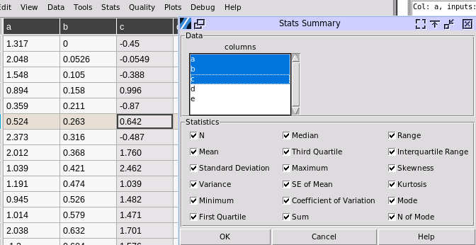
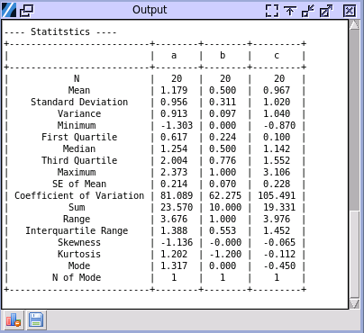

Stats Menu
==========

Describe
--------

To start, choose stats>Describe.

.. image:: images/describe1.png
   :align: center

- **Stats Summary:** Choose the column of data to get the statistical summary.

- **Percentiles for Quantiles:** The default percentiles to calculate can be changed in the input box. The numbers are in percentage. For example, 100 is 100%. Separate the numbers with a comma, while space is optional.

The sample output is:

.. image:: images/describe2.png
   :align: center

The statistical items on the top table are locked by default, while the percentiles on the lower one depend on the input. Here are the explanations of the statistical items:

- **N:** The total number of valid inputted numbers.

- **Mean:** The average of all valid inputted numbers.

- **StDev:** The standard deviation of all valid inputs. The formula for standard deviation is :math:`\sigma = \sqrt{\frac{\sum_{i=1}^{n} (x_i - \mu)^2}{n}}`.

- **SE Mean:** The standard error of the mean quantifies the variability of sample means around the true population mean. :math:`\text{SEM} = \frac{\sigma}{\sqrt{n}}`

- **Variance:** The variance of the inputted numbers, which is the square of the standard deviation. The standard deviation is always the square root of the variance. The formula for variance is :math:`\sigma^2 = \frac{\sum_{i=1}^{n} (x_i - \mu)^2}{n}`. The relationship between standard deviation and variance is :math:`\sigma = \sqrt{\sigma^2}`.

- **CoefVar:** The coefficient of variation (CV) is a statistical measure that represents the ratio of the standard deviation to the mean. The formula for coefficient of variation is :math:`CV = \left(\frac{\sigma}{\mu}\right) \times 100`.

- **Sum:** The total sum of all valid inputted numbers.

- **Min:** The minimum of all valid inputted numbers.

- **Q1:** Q1, or the First Quartile, is a measure of statistical dispersion that indicates the value below which 25% of the data falls. It essentially marks the 25th percentile of a dataset.

- **Median:** The median is a measure of central tendency that represents the middle value in a dataset when it is arranged in ascending order. It effectively divides the dataset into two equal halves, with 50% of the data points lying below and 50% above.

- **Q3:** Q3, also known as the upper quartile, is the value that separates the highest 25% of data points from the lower 75% in an ordered dataset. It marks the 75th percentile of the data distribution.

- **Max:** The maximum of all valid inputted numbers.

- **Range:** The difference between Max and Min.

- **IQR:** The Interquartile Range (IQR) is the difference between the third quartile (Q3) and the first quartile (Q1) of a dataset. It represents the middle 50% of the data.

- **Mode:** In statistics, the mode is the value that appears most frequently in a dataset. For example, in the set {2, 3, 3, 4, 5, 5, 5, 6}, the mode is 5.

- **N for Mode:** The number of times that Mode appears in the dataset.

- **Skewness:** Skewness measures the extent to which a distribution deviates from symmetry around its mean. `WIKI LINK <https://en.wikipedia.org/wiki/Skewness>`_

- **Kurtosis:** Kurtosis is a statistical measure that describes the shape of a probability distribution, specifically focusing on its "tailedness". `WIKI LINK <https://en.wikipedia.org/wiki/Kurtosis>`_

- **Percentiles:** A percentile is a value below which a certain percentage of observations fall in a dataset. `WIKI LINK <https://en.wikipedia.org/wiki/Percentile>`_

Describe MultiVar
-----------------

Choose Stats>Describe MultiVar. This calculates the same statistical summary upon multiple sets of data, i.e., multiple columns.

- **Data column:** One or multiple column names can be selected using left click to toggle selection, and also combining with CTRL and SHIFT.

- **Statistics**: Toggle each statistical item that will be printed out in output.

A sample output:

Normality
---------