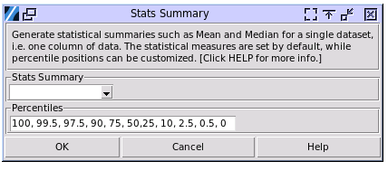

Stats Menu
==========

Describe
--------

To start, choose stats>Describe. 

- Stats Summary: Choose the column of data to get the stastical summary. 
- The default percentiles to calculate can be changed in the input box, the numbers are in percentage. For example, 100 is 100%. Separate the number with comma, while space is optional.

The sample output is:

.. image:: images/describe2.png
   :align: center

The statstical items on the top table is locked by default, while the percentiles on the lower one depend on the input. Here are the explanation of the statstical items:

- N: The total number of valid inputed numbers.
- Mean: The average of all valid inputed numbers.
- StDev: The standard deviation of all valid inputs. The formula for standard deviation is :math:`\sigma = \sqrt{\frac{\sum_{i=1}^{n} (x_i - \mu)^2}{n}}`
- SE Mean:  Standard Error (SE) of the mean, which is SE = s / √n.
- Variance: The Variance of the inputed numbers, which is square of standard deviation. The standard deviation is always the square root of the variance. The formula for variance is :math:`\sigma^2 = \frac{\sum_{i=1}^{n} (x_i - \mu)^2}{n}` The relationship between standard deviation and variance is :math:`\sigma = \sqrt{\sigma^2}`
- CoefVar: The coefficient of variation (CV) is a statistical measure that represents the ratio of the standard deviation to the mean. The formula for coefficient of variation is :math:`CV = \left(\frac{\sigma}{\mu}\right) \times 100`
- Sum: The total sum of all valid inputed numbers.
- Min: The minimum of all valid inputed numbers.
- Q1: Q1, or the First Quartile, is a measure of statistical dispersion that indicates the value below which 25% of the data falls. It essentially marks the 25th percentile of a dataset.
- Median: The median is a measure of central tendency that represents the middle value in a dataset when it is arranged in ascending order. It effectively divides the dataset into two equal halves, with 50% of the data points lying below the median and 50% above.
- Q3: Q3, also known as the upper quartile, is the value that separates the highest 25% of data points from the lower 75% in an ordered dataset. It marks the 75th percentile of the data distribution.
- Max: the maximum of the all valid inputed numbers.
- Range: The difference between Max and Min.
- IQR: The Interquartile Range (IQR) is the difference between the third quartile (Q3) and the first quartile (Q1) of a dataset. It represents the middle 50% of the data.
- Mode: In statistics, the mode is the value that appears most frequently in a dataset. For example, in the set {2, 3, 3, 4, 5, 5, 5, 6}, the mode is 5.
- N for Mode: The number of times of the Mode appearing in the data set.
- Skewness: Skewness measures the extent to which a distribution deviates from symmetry around its mean. `WIKI LINK <https://en.wikipedia.org/wiki/Skewness>`_
- Kurtosis: Kurtosis is a statistical measure that describes the shape of a probability distribution, specifically focusing on the "tailedness" of the distribution. `WIKI LINK  <https://en.wikipedia.org/wiki/Kurtosis>`_
- Percentiles: A percentile is a value below which a certain percentage of observations fall in a dataset. `WIKI LINK <https://en.wikipedia.org/wiki/Percentile>`_

Describe MultiVar
-----------------

To calculate the same statistical summary upon multiple sets of data, i.e. multiple columns. 

.. image :: images/multides1.png
   :align: center

- In the Data column session, one or multiple column names can be selected. Using left click to toggle the selection, and also combining with CTRL and SHIFT.
- Toggle the selection of each statstical item that will be printed out in the output.

A sample output.
.. image :: images/multides2.png
   :align: center

Normality
--------
