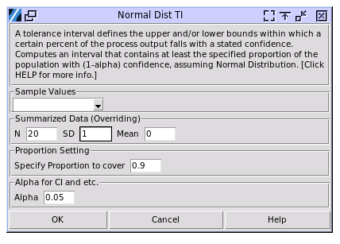

.. raw:: html

   

Tolerance Interval
------------------

Tolerance intervals estimate a range that is likely to contain a specified proportion of future product measurements, given a desired confidence level. These intervals define upper and/or lower bounds where, at least, a certain percentage of the process output is expected to fall, combining both the target population coverage and statistical certainty.

The population distribution will be assumed as normal. Calculation for non-normal distributions is not available yet.

To perform the study choose Quality > Tolerance Interval

- **Sample Values**: Select the column containing the sample values from the population to be studied. The values have to be numerical and continuous. 
- **Summerized Data**: Input the number of sample points, their mean and standard deviation instead of providing the sample data set. The input will override the sample data column selection.
- **Specify Proportion to Cover**: The percentage of the population you want to capture. For example, to calculate at least 80% of the process output will fall into the interval, at given confidence level, input 0.8.
- **Alpha**: Define the confidence level in the calculation. For example, to calculate at least a given potion of the process output to fall into the interval, at 80% confidence level, input 0.2. While for the most commmon 95% confidence level, keep the default 0.05 input.
  

Unlike confidence intervals (which estimate where a population parameter lies) or prediction intervals (which predict where future observations will fall), tolerance intervals aim to capture a specific percentage of the entire population.

.. list-table:: Comparison of Statistical Intervals
   :header-rows: 1
   :widths: 20 30 30 30

   * - Characteristic
     - Confidence Interval (CI)
     - Prediction Interval (PI)
     - Tolerance Interval (TI)
   * - Purpose
     - Estimates where a population parameter lies
     - Predicts where future individual observations will fall
     - Defines a range containing a specified proportion of the population
   * - Answers question
     - Where is the true population mean, variance, or other parameter?
     - Where will the next observation(s) fall?
     - Where do X% of all population values lie?
   * - Key components
     - - Confidence level (1-α)
     - - Confidence level (1-α)
     - - Coverage proportion (p)
       - Confidence level (1-α)
   * - Interpretation
     - We are (1-α)% confident that the interval contains the true parameter
     - We are (1-α)% confident that a future observation will fall in this interval
     - We are (1-α)% confident that at least p% of the population falls within this interval
   * - Width characteristics
     - Narrows as sample size increases
     - Always wider than a CI; affected by both parameter uncertainty and individual variation
     - Widest of the three; affected by sample size, coverage proportion, and confidence level
   * - Common uses
     - - Estimating population parameters
       - Hypothesis testing
       - Research reporting
     - - Forecasting
       - Process monitoring
       - Identifying outliers
     - - Quality control
       - Manufacturing specs
       - Regulatory compliance
       - Reference ranges
   * - Example
     - "We are 95% confident the true mean weight is between 9.8-10.2 kg"
     - "We are 95% confident the next measurement will be between 9.5-10.5 kg"
     - "We are 99% confident that 95% of all products will weigh between 9.2-10.8 kg"

Here below is the sample output of the calculation. It includes two-side and one-side intervals, and is pretty self explaining. 
     
.. code:: none

  ---- Tolerance Interval ----
  95.00% confident that at least 90.00% of the 
  population's values for this characteristic will 
  fall between -2.32 and 2.32
  +------------+----------+----------+---------+
  | Proportion | Lower TI | Upper TI | 1-Alpha |
  +------------+----------+----------+---------+
  |    0.90    |  -2.32   |   2.32   |  0.950  |
  +------------+----------+----------+---------+
  
  One-Sided Tolerance Interval
  +------------+----------+----------+---------+
  | Proportion | Lower TI | Upper TI | 1-Alpha |
  +------------+----------+----------+---------+
  |    0.90    |  -1.93   |    -     |  0.950  |
  |    0.90    |    -     |   1.93   |  0.950  |
  +------------+----------+----------+---------+

